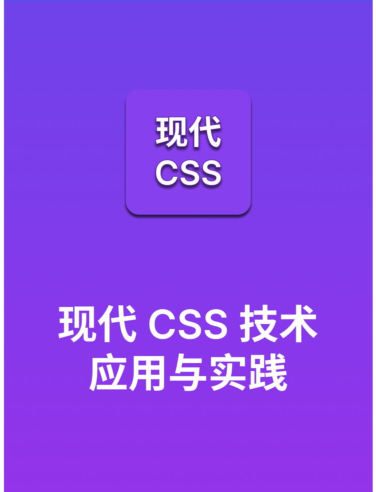

<h1 align="center">Hi 👋, I'm FEDLAB</h1>
<h3 align="center">微信公众号：FED实验室（前端开发实验室），专注于前端全栈开发方向。</h3>

<h3 align="left">Connect with me: </h3>

<a href="mailto:fedlab@163.com">Email: feadlab@163.com</a>

<h3 align="left">WeChat Official Account: </h3>

<h3 align="left">Languages and Tools:</h3>

                                                

## FED实验室-小册

- [现代CSS技术应用与实践小册介绍](./现代CSS技术应用与实践小册/小册介绍.md)

  <a
      href="https://mp.weixin.qq.com/mp/appmsgalbum?__biz=MzI2NjUxODkzOA==&action=getalbum&album_id=3114397000008974342#wechat_redirect"
      title="现代CSS技术应用与实践"
      style="display: block; text-align: center"
      >
      
      
现代CSS技术应用与实践

  </a>

## FED实验室-文章列表

- [ECMAScript 2024(ES15) 新特性完全解析](http://mp.weixin.qq.com/s?__biz=MzI2NjUxODkzOA==&mid=2247489079&idx=1&sn=b9bd4a70dcae7888cf12cf21f62edc0e&chksm=ea8dbec2ddfa37d4232b51defb67e367f36638390aededc27e7127037abd439c6b522cc652c8#rd)
  - 时间：2024-09-01 13:37
  - 摘要：ECMAScript 2024 引入了许多新的特性，提高了二进制数据管理、字符串操作以及异步操作处理的能力。这些变更于 2024 年 6 月 26 日获得批准，旨在使 JavaScript 更强大、更灵活。
- [现代 CSS：深入理解 CSS 伪元素](http://mp.weixin.qq.com/s?__biz=MzI2NjUxODkzOA==&mid=2247489063&idx=1&sn=346cc1bc2f0ddcb04fbc61bc8c500df0&chksm=ea8dbed2ddfa37c4cbe6896361d0fa5605df665ff3ad1a268b903a45feadd5146b460dfe62e1#rd)
  - 时间：2024-08-31 22:14
  - 摘要：Pseudo-elements 在现代 Web 布局中引用广泛，它允许你在不影响原始元素的情况下创建/操作原始
- [Vue 3.5 即将发布，新特性抢先看](http://mp.weixin.qq.com/s?__biz=MzI2NjUxODkzOA==&mid=2247489045&idx=1&sn=8e59b5129b3c0f12291b6230e5878429&chksm=ea8dbee0ddfa37f6d186bb25a1a4b5ac96ff8ef85566158075e9d1955edbe7289b4619ce74ee#rd)
  - 时间：2024-08-31 15:01
  - 摘要：2024年08月29，Vue 发布 v3.5 rc(Release Candidate) 版本，预示着 v3.5 稳定版本即将发布。该版本带来了一系列增强功能、新特性和重要变更，以改善开发和用户体验。
- [Chrome 128 DevTools 新功能速览](http://mp.weixin.qq.com/s?__biz=MzI2NjUxODkzOA==&mid=2247489025&idx=1&sn=f893d54926fe75619e0a3e2c0746adf1&chksm=ea8dbef4ddfa37e26b14a9cf5cf2343fa4c59df10f0602b69573dd2e8b9fa0e55f95d19f0759#rd)
  - 时间：2024-08-30 14:02
  - 摘要：Chrome 128 版本已正式发布，DevTools 也带来众多特性更新，主要包括：网络面板支持复制 Network 面板中列出的所有请求。元素面板支持打开Animation面板以拍摄动画并可以实时修改 @keyframes 样式。
- [最后一个 1.x 版本：Deno v1.46 正式发布](http://mp.weixin.qq.com/s?__biz=MzI2NjUxODkzOA==&mid=2247489013&idx=1&sn=87bedaf9d009b36e3358f8fe31cb4034&chksm=ea8dbd00ddfa341669d55e98e3edc9e6bb086d51f19bb8e82e2fba186f54a722ded0d59bbf24#rd)
  - 时间：2024-08-29 11:39
  - 摘要：Deno 的最后一个 1.x 版本：v1.46 正式发布。其内置格式器 deno fmt 现在支持 HTML、CSS、SCSS、Sass、Less、YAML、Astro、Angular、Svelte 和 Vue等文件。
- [Vite 迁移 Rspack 快速指南](http://mp.weixin.qq.com/s?__biz=MzI2NjUxODkzOA==&mid=2247489013&idx=2&sn=7f143b412f0f2a839fc14fd6f5be4715&chksm=ea8dbd00ddfa3416a4b8e59bf151bff63279a2e78c583e8b34a0400ab2d318cf7da702d90690#rd)
  - 时间：2024-08-29 11:39
  - 摘要：关注下方公众号，获取更多热点资讯Vite 是一个现代化的前端构建工具，以其快速的冷启动和模块热替换（HMR）而
- [里程碑！Rspack 1.0 正式发布](http://mp.weixin.qq.com/s?__biz=MzI2NjUxODkzOA==&mid=2247488978&idx=1&sn=6c7c06f08062d03d0eecf11de3e7affb&chksm=ea8dbd27ddfa34311802c8fe4ebef5c874e8954d461e9d26a35b708f809bdc3cdb05070f3aa7#rd)
  - 时间：2024-08-28 13:55
  - 摘要：2024年08月28日，Rspack 1.0 版本正式发布。这意味着 Rspack 已经达到生产稳定，覆盖了 webpack 绝大多数的 API 和功能，并已经做好支持更多用户的准备。
- [2024年前端状态管理工具大盘点](http://mp.weixin.qq.com/s?__biz=MzI2NjUxODkzOA==&mid=2247488970&idx=1&sn=6cf89c7c4d3a07399c675a9338b861a6&chksm=ea8dbd3fddfa342947748655321b99bd485503728df9d4b29d46e602c4b86136e828943f1d5c#rd)
  - 时间：2024-08-27 15:59
  - 摘要：React 相关的状态管理工具有 Redux、MobX、Zustand、Jotai等。Vue.js 比较流行的状态管理工具有 Vuex 和 Pinia。而Tanstack Query 因其众多优点也深受开发者的喜爱。
- [突发！IBM 关闭中国区业务，裁员超1000人](http://mp.weixin.qq.com/s?__biz=MzI2NjUxODkzOA==&mid=2247488945&idx=1&sn=2a31ef9d3011f0d456b273a978cf6c3c&chksm=ea8dbd44ddfa34527d75561b20fda563de15dcbb098ac740e9ec9067785860ceac23af7e0226#rd)
  - 时间：2024-08-26 20:56
  - 摘要：2024年08月26日，IBM中国举办了一个简短的3分钟全员会议。会上，IBM宣布：IBM基础设施将撤离位于中国的IBM中国系统中心（CSL）和IBM中国开发中心（CDL）的所有研发工作，并将这些实验室迁移至海外的其他IBM基础设施基地。
- [Electron 32.0.0 正式发布，新特性速览](http://mp.weixin.qq.com/s?__biz=MzI2NjUxODkzOA==&mid=2247488936&idx=1&sn=aa863ce2f3039c76536f10fa49305781&chksm=ea8dbd5dddfa344b93edf2b77d758149f86b100c2a9bbe6831448c4483075862b9acd47eda85#rd)
  - 时间：2024-08-26 16:44
  - 摘要：Electron 32.0.0 版本带来了一系列新特性和改进，涵盖了技术栈升级、API 文档、视图扩展、导航 API、性能监控等方面
- [AI 大模型时代，对前端工程师有哪些机遇和挑战？](http://mp.weixin.qq.com/s?__biz=MzI2NjUxODkzOA==&mid=2247488927&idx=1&sn=a69ca7ad7da163d3e200b81da0e2a02c&chksm=ea8dbd6addfa347c4a07b6d5a2412c0d0d1d80a7e51be9b98995a4c33f663cec04a8964004eb#rd)
  - 时间：2024-08-26 09:50
  - 摘要：随着人工智能的发展，AI大模型为人工智能领域带来了巨大的机遇和挑战。前端工程师作为软件开发的重要一环，也需要关注 AI 大模型的发展趋势，并探索如何将其应用于前端开发和优化中。
- [人形机器人的快速发展，会对哪些行业带来较大冲击？](http://mp.weixin.qq.com/s?__biz=MzI2NjUxODkzOA==&mid=2247488917&idx=1&sn=dad40efb91429af668128cd947769cec&chksm=ea8dbd60ddfa347601fa6e80b001a4cf3547b6221122a9e750cc2daf546522e25ccc15df2665#rd)
  - 时间：2024-08-26 08:38
  - 摘要：2024年8月21日上午，备受瞩目的2024世界机器人大会在北京北人亦创国际会展中心盛大开幕，大会中有27款人形机器人将集中亮相。随着人形机器人的快速发展，将会对哪些行业带来比较大的冲击？
- [Axios 与 Fetch：哪一个更值得选？](http://mp.weixin.qq.com/s?__biz=MzI2NjUxODkzOA==&mid=2247488906&idx=1&sn=d15a3c5bfd8f903fd42ac8a94c030101&chksm=ea8dbd7fddfa34696849d879c621ed73eee1a118962928f364173a283ae8d60da6e0c07dc151#rd)
  - 时间：2024-08-25 19:58
  - 摘要：Axios 和 Fetch API 都是用于发起 HTTP 请求的工具，它们各自有一些优势和特点。选择哪个工具取决于你的需求和项目环境。本文重点剖析两个工具的优缺点。
- [深入解读 React 19 新特性](http://mp.weixin.qq.com/s?__biz=MzI2NjUxODkzOA==&mid=2247488889&idx=1&sn=cc04e0c25274bfdade2587935e8b3ad5&chksm=ea8dbd8cddfa349a0e641855a7b7093097cc5eecc81764475b7e71ef27f678c1fb382e81e034#rd)
  - 时间：2024-08-25 16:10
  - 摘要：React 19 引入了一系列新特性，旨在提升开发效率和用户体验。其中最引人注目的是服务器组件，它允许在服务器端渲染 React 组件，从而加快页面加载速度并改善 SEO。这些新特性共同推动了 React 向更高效、更易用的方向发展。
- [Postman 最佳平替，Bruno 为什么如此优秀？](http://mp.weixin.qq.com/s?__biz=MzI2NjUxODkzOA==&mid=2247488873&idx=1&sn=e65b478d7df73b19fda03c8e1bcf1586&chksm=ea8dbd9cddfa348a534516fe455f4a22340a934dcf474e5ee8c8de84f42a79b7ba948321176e#rd)
  - 时间：2024-07-10 21:59
  - 摘要：Bruno 是一款快速、Git 友好的开源 API 客户端，旨在彻底改变以 Postman、Insomnia 和其他类似工具为代表的现状。Bruno 在03月10日成为 Hacker News 上最火开源软件，6 小时荣登榜首。
- [Node.js 15 岁啦！🎉🎉🎉](http://mp.weixin.qq.com/s?__biz=MzI2NjUxODkzOA==&mid=2247488850&idx=1&sn=4c40b10877450f50082601f4c66e1170&chksm=ea8dbda7ddfa34b1a2e499c0180912a889ba5a3c2078bb5689d022832c53d90805674f547c86#rd)
  - 时间：2024-05-28 08:06
  - 摘要：Happy Birthday. 🎂🥳🎉🍾，官方非常感谢社区多年来的支持。 它以速度和可扩展性彻底改变了 Web 开发！ 多年来，很多团队依靠 Node.js 来创建弹性、高性能的 Web 解决方案。
- [超实用！一键试衣浏览器插件](http://mp.weixin.qq.com/s?__biz=MzI2NjUxODkzOA==&mid=2247488838&idx=1&sn=269d9ed1871023480cb074b695de315d&chksm=ea8dbdb3ddfa34a578fc6eedd6fed9c2dc3414d5ca46c81348e389d797885dfec6576acd9a09#rd)
  - 时间：2024-05-13 23:23
  - 摘要：[玫瑰]&nbsp;网页版体验：https://heybeauty.ai/ [玫瑰]&nbsp;浏览器插件：Try-on with HeyBeauty 即将上线，敬请期待～ [玫瑰] 作者：@idoubi，大家多支持！
- [Zed vs VS Code：新代码编辑器时代已经到来！](http://mp.weixin.qq.com/s?__biz=MzI2NjUxODkzOA==&mid=2247488808&idx=1&sn=e1a8a462c8c35a6540c35e27b6fd4df2&chksm=ea8dbdddddfa34cb032e331b012d0b8889bc6f7b3be5a50733c7f24424cb98fa2b09ce085dc8#rd)
  - 时间：2024-05-12 17:19
  - 摘要：过去的近十年，微软公司的 Visual Studio Code（VS Code）一直是开发者社区首选的文本编辑器。Zed 作为一款快速、开源的代码编辑器，正在掀起一股新的浪潮。
- [超10万次查看，前端这个话题又火了！](http://mp.weixin.qq.com/s?__biz=MzI2NjUxODkzOA==&mid=2247488794&idx=1&sn=61b950a48ff2ce8baf204aebd3c55b42&chksm=ea8dbdefddfa34f9335a9264dafb23aa8546dd5f40066dd80f81446f00716274e7584c670a85#rd)
  - 时间：2024-05-10 00:00
  - 摘要：做好自己，你就是金字塔的塔尖。近些年，前端的发展确实快。但是2017年后，前端基本稳定，尤其感受到这几年主流框架趋于稳定。
- [是的，我们回来了！](http://mp.weixin.qq.com/s?__biz=MzI2NjUxODkzOA==&mid=2247488784&idx=1&sn=b1b51d9dc1ac700c31e7031d436a9458&chksm=ea8dbde5ddfa34f30d043e94e9247553de25d94e5cbc50a7ace18924ed9bf286d439978080c7#rd)
  - 时间：2024-05-09 08:28
  - 摘要：
- [React 和 Vue 官网都给安排上了！](http://mp.weixin.qq.com/s?__biz=MzI2NjUxODkzOA==&mid=2247488776&idx=1&sn=fc8bc27b27a98e289a0660a17acac708&chksm=ea8dbdfdddfa34ebf24c0912d638fa1c7488e529483e076e3473e13ef474922279c2f8edc260#rd)
  - 时间：2024-05-01 10:55
  - 摘要：最近的流行风，react 和 vue 都给安排上了。🤓URL 中拼接 uwu=true 参数即可体验。
- [面试题：隐藏页面元素方法有哪些？](http://mp.weixin.qq.com/s?__biz=MzI2NjUxODkzOA==&mid=2247488726&idx=1&sn=9671d6286b7910111f768e9a4d73007f&chksm=ea8dbc23ddfa3535396d74df2f6cd83032f4f5c7d864cbb4585a8fe3ca6eec86086ed7fa437d#rd)
  - 时间：2024-04-25 23:39
  - 摘要：本文主要包含以下3个方面内容：1. 在元素没有子元素的情况下，使用 `:empty` 伪类来隐藏元素；2. 将 `:empty` 与 `:has()` 和 `:not()` 结合使用，可以处理更多情况；3. 梳理隐藏元素的常见方法。
- [这几个顶级 GitHub 仓库，千万不要错过！](http://mp.weixin.qq.com/s?__biz=MzI2NjUxODkzOA==&mid=2247488716&idx=1&sn=ba047a783f0d586211536d2dac8d3802&chksm=ea8dbc39ddfa352f4c67d15c031cda16bcbba703034c5d2f08696468fd2161ac99988e583d82#rd)
  - 时间：2024-04-23 23:54
  - 摘要：这几个顶级 GitHub 仓库，千万不要错过！
- [2024年，你应该了解的几个CSS新特性！](http://mp.weixin.qq.com/s?__biz=MzI2NjUxODkzOA==&mid=2247488699&idx=1&sn=9620a9b74aa8186126de58b094b82de8&chksm=ea8dbc4eddfa3558be41742c2e91d6720db134824f8d5876662add6bd29b8e9498c471bbb1cb#rd)
  - 时间：2024-04-22 23:56
  - 摘要：2024年应该知道的5个CSS特性；
- [面试题：JavaScript 中 || 和 ?? 运算符的区别？](http://mp.weixin.qq.com/s?__biz=MzI2NjUxODkzOA==&mid=2247488695&idx=1&sn=5c37a3bab0b0dd14c80bb36a34f6aa47&chksm=ea8dbc42ddfa355481952a6c75e7827f6e5092dccb65490e02791713db8a90ecba2b647f3b89#rd)
  - 时间：2024-04-21 23:39
  - 摘要：今天来看看前端面试题中常常被开发者混淆的运算符问题，逻辑或运算符（||）和空值合并运算符（??）。
- [为什么建议你用 Pinia 替换 Vuex？](http://mp.weixin.qq.com/s?__biz=MzI2NjUxODkzOA==&mid=2247488682&idx=1&sn=1f404655b10b29c25c02fb218a13ec9e&chksm=ea8dbc5fddfa3549cc886aa8e9813b774c182d8877fc2b6fc9d3fefdfee027d1b978091d7ba4#rd)
  - 时间：2024-04-20 22:37
  - 摘要：在 Vue.js 项目状态管理技术选型时，经常会遇到选择 Vuex 还是 Pinia 的问题。Pinia 被 Vue.js 官方网站列为 Vue.js 的推荐状态管理工具，这可能是它被受欢迎的原因之一。
- [NPM 和 Yarn 的挑战者：PNPM v9.0.0 发布，带来众多改进！](http://mp.weixin.qq.com/s?__biz=MzI2NjUxODkzOA==&mid=2247488669&idx=1&sn=c9970e78fbce0531f83937c6179278ac&chksm=ea8dbc68ddfa357e50910faf902faaa7361aaa4a30d8e3c7abf2f1e101f653b69577892ed8ad#rd)
  - 时间：2024-04-18 22:53
  - 摘要：长期以来，NPM 一直是行业标准，但现在出现了一个新的竞争者：PNPM。PNPM 提供了高速度、资源效率、有洞察力的日志，并且效率是 NPM 的 3 倍
- [Chrome 124 DevTools 新功能速览](http://mp.weixin.qq.com/s?__biz=MzI2NjUxODkzOA==&mid=2247488659&idx=1&sn=4fc2d0ab2c6a5e21aaf577e8cd69ebb7&chksm=ea8dbc66ddfa3570d1dee53508acdd76e5d852b20e872d82fe14eeaebfb3065ca3aeb4a62fed#rd)
  - 时间：2024-04-17 23:14
  - 摘要：2024年04月16日，Chrome 124 稳定版本已正式发布，带来众多特性更新，大家可以下载和升级使用。同时，Chrome DevTools 也带来众多特性更新
- [未来的 Vue.js！](http://mp.weixin.qq.com/s?__biz=MzI2NjUxODkzOA==&mid=2247488645&idx=1&sn=af16194c00122ca2b90a967fd4fa5646&chksm=ea8dbc70ddfa35664ec73050cdc4f0fe92a43c23031a45a064537dae71115290ed9dbbbd0337#rd)
  - 时间：2024-04-16 23:37
  - 摘要：Vue 生态系统最令人兴奋的发展之一是引入了 "Vapor 模式"。它是一种编译策略，其灵感来自于 Solid，这项创新旨在移除虚拟 DOM，以提高性能，同时保持当前脚本设置语法与组成 API。
- [为什么我选择用 Biome 平替 ESLint 和 Prettier？](http://mp.weixin.qq.com/s?__biz=MzI2NjUxODkzOA==&mid=2247488633&idx=1&sn=bada865d0ed495140ee77b3d974d6964&chksm=ea8dbc8cddfa359a3e6c9354ac77ebc2515699bef97526ac94280e052c71a6946bd96f8aee1b#rd)
  - 时间：2024-04-15 23:49
  - 摘要：Biome 被称为下一代代码格式化和检查工具，它基于 Rust 开发，堪称是 ESLint 与 Prettier 的完美结合，它为开发者提供了极致的便捷与高效，让日常代码开发变得更加轻松、流畅。
- [全网最全的 JavaScript 运行时大盘点](http://mp.weixin.qq.com/s?__biz=MzI2NjUxODkzOA==&mid=2247488618&idx=1&sn=9561673f5cda322df15218bdc3b24c53&chksm=ea8dbc9fddfa35892a8215922c3fc9ba24b0d79c6d47bb61663f3ace812c185481c84a086d38#rd)
  - 时间：2024-04-14 22:55
  - 摘要：对于大多数前端开发者而言，可能对 Node.js、Deno、Bun 这几个比较熟悉，对 edge-light、LLTR、fastly、netlify、wasmer、workerd 确很少听说。下面将对这些运行时做一下详细介绍。
- [Node.js v22.0.0 来了，定档4月23日！](http://mp.weixin.qq.com/s?__biz=MzI2NjUxODkzOA==&mid=2247488612&idx=1&sn=cb50e468dd0b8dbbc8f922cf880dd335&chksm=ea8dbc91ddfa3587efd7820d96d8d0070aaa0e5f7ebe453a4c36908e249bc67490f04a829e55#rd)
  - 时间：2024-04-13 23:40
  - 摘要：2024年04月13日，@RafaelGSS(Nodejs TSC) 提交了一个PR，将 v22.0.0-proposal 分支合并到 main。这也预示着 Node.js V22.0.0 即将发布。
- [前端开发人员必备的 10 个 GitHub 仓库](http://mp.weixin.qq.com/s?__biz=MzI2NjUxODkzOA==&mid=2247488604&idx=1&sn=00948214112810020023024c82a96288&chksm=ea8dbca9ddfa35bfa2498c04aa83df8cba92c3adae4ef550e006f2d2602d0a35fb86bfab02a4#rd)
  - 时间：2024-04-12 22:38
  - 摘要：盘点前端开发人员必备的 10 个 GitHub 仓库
- [React 19，创建 JSX 元素的速度将更快！](http://mp.weixin.qq.com/s?__biz=MzI2NjUxODkzOA==&mid=2247488598&idx=1&sn=0a9800c5b09a0479e570ffeca094c96e&chksm=ea8dbca3ddfa35b587234b611080420c949019ecbf07e1235e1bd32bbc6180fb3844624da223#rd)
  - 时间：2024-04-11 22:22
  - 摘要：2024年04月11日，React 19 创建 JSX 元素的速度将更快！本篇文章来一起看看为什么会更快？
- [Vue 样式穿透不生效？看这篇就够了](http://mp.weixin.qq.com/s?__biz=MzI2NjUxODkzOA==&mid=2247488588&idx=1&sn=0542cfe07c0ad3810cad3511001125e9&chksm=ea8dbcb9ddfa35af212c3ba6ba8c804c410c9838838dbd43c77c65da1a522982de544f5f83a3#rd)
  - 时间：2024-04-10 23:59
  - 摘要：在日常 Vue 开发中，经常会遇到样式穿透不生效的情况。如果是选择器优先级问题或者穿透写法问题，这种比较好理解，提升优先级调整写法就好，但在 Vue 中有时候需要将 scoped 去掉才能生效，有时候又不能去掉 scoped，现整理如下
- [JS Linter，你最钟爱哪一款？](http://mp.weixin.qq.com/s?__biz=MzI2NjUxODkzOA==&mid=2247488570&idx=1&sn=c8f73074808e03aad26bd4075a38e433&chksm=ea8dbccfddfa35d9edc667a7f2c480696f9b5c1ab1ab8e47973773e580db05883085dfe2f3b2#rd)
  - 时间：2024-04-09 23:59
  - 摘要：​2024 年是行业标准 ESLint 独占鳌头，还是 Deno Lint、Biome、quick-lint-js 或 Oxlint 将取代 ESLint？或者是尚未问世的 JS Linter 新产品夺得桂冠？
- [基于 Bun 的这款 Web 框架，比 Express 快 21 倍！](http://mp.weixin.qq.com/s?__biz=MzI2NjUxODkzOA==&mid=2247488555&idx=1&sn=866690051870d0b58b17d1c06ad11b5e&chksm=ea8dbcdeddfa35c85f8786d6d3a3caee3bc41f6034e2b6332dedf57a081aa68d1eb5b4cbe562#rd)
  - 时间：2024-04-08 07:54
  - 摘要：ElysiaJS 是一个由 Bun 增强的 TypeScript 框架，具有端到端的类型安全、统一的类型系统和出色的开发人员体验。当前 Github star 数 7.7k。
- [fnm：基于 Rust 的 Node.js 版本管理器，速度更快！](http://mp.weixin.qq.com/s?__biz=MzI2NjUxODkzOA==&mid=2247488540&idx=1&sn=83b686bf6cb815de38cfcdc6a54b9b8f&chksm=ea8dbce9ddfa35ffd30ccb3197e647b1cc1dfead0264427339d5b1e5b3c9c44423865f189904#rd)
  - 时间：2024-04-07 11:36
  - 摘要：fnm（Fast Node Manager）是一款用 Rust 编写的跨平台 Node.js 版本管理器。它支持 .nvmrc 文件和 Fish shell。它可在 Linux 和 Mac 上运行，以单个可执行文件的形式发布。
- [ESLint v9.0.0 正式发布，带来重大更新及破坏性更改！](http://mp.weixin.qq.com/s?__biz=MzI2NjUxODkzOA==&mid=2247488528&idx=1&sn=95fe8838bcbadcda3c1b88c050da20ed&chksm=ea8dbce5ddfa35f367392426714dcb8a7333c59e2b5e9cb4d9a42de96bc8d699c89e9cd2503c#rd)
  - 时间：2024-04-06 10:50
  - 摘要：关注下方公众号，获取更多热点资讯今天是坚持日更的第212天，如果本文对您有帮助，记得点击关注、点赞、在看支持我
- [下一代 CSS 框架：Mojo CSS，为何如此受欢迎？](http://mp.weixin.qq.com/s?__biz=MzI2NjUxODkzOA==&mid=2247488518&idx=1&sn=d58d5ddf09015a3995bb8f0ac3e9e6a4&chksm=ea8dbcf3ddfa35e557806e8588193ae568a313a71103223a5c6b375a94d882604be332dd25c7#rd)
  - 时间：2024-04-04 12:28
  - 摘要：Mojo CSS 定位为下一代原子级 CSS 框架。它于 2023 年发布，该框架的工作原理是扫描你的代码并实时创建 CSS 视觉效果，而无需你编写新的 CSS 代码。
- [今日推荐：完美平替 Express 和 Koa 的两个框架](http://mp.weixin.qq.com/s?__biz=MzI2NjUxODkzOA==&mid=2247488503&idx=2&sn=002f2d540a1afae445b9cfd811b1d07d&chksm=ea8dbb02ddfa3214a2c87e9613961884b949b09d4515dfc062d24c8a918e1d3a14db8714c3a4#rd)
  - 时间：2024-04-03 10:20
  - 摘要：Express 和 Koa 框架已经出来很久了，除了这两个“老古董”框架，还有什么让开发者可以快速上手的 Node 框架？本文推荐两个不错的可以完美平替 Express 和 Koa 的框架
- [相比 Postman，Bruno 为何如此优秀？](http://mp.weixin.qq.com/s?__biz=MzI2NjUxODkzOA==&mid=2247488468&idx=1&sn=271eb0eb2a57ac794d8de4255ce28805&chksm=ea8dbb21ddfa32372bfe8985e068fc25626c3cc513cc8cfa0884eee6caf56d6ebf77da76c497#rd)
  - 时间：2024-03-31 23:15
  - 摘要：Bruno 是一款快速、Git 友好的开源 API 客户端，旨在彻底改变以 Postman、Insomnia 和其他类似工具为代表的现状。
- [Nuxt 4 要来了！Nuxt 发展回顾与展望](http://mp.weixin.qq.com/s?__biz=MzI2NjUxODkzOA==&mid=2247488454&idx=1&sn=e4e089c0d96f72b85207562dd79b0d9f&chksm=ea8dbb33ddfa322541beda922db1655d02866f6c43a387d252910a159eff169054937dc29206#rd)
  - 时间：2024-03-30 17:46
  - 摘要：过去的一年是 Nuxt 快速发展的一年。Nuxt 发生了很多大事，迈过了很多新的里程碑，本文将介绍 Nuxt 团队成员 @Atinux 和 @danielcroe 代表整个团队分享他们取得的成就和对下一步发展的看法。
- [好消息，View Transitions Level 2 来了！](http://mp.weixin.qq.com/s?__biz=MzI2NjUxODkzOA==&mid=2247488445&idx=1&sn=8cb5aa81f0dd1c03434d2167bdad2844&chksm=ea8dbb48ddfa325ee5085e6978e32bfbc740fc20ee6bb51fa9edd4cbe8b868babade329ecc04#rd)
  - 时间：2024-03-29 07:30
  - 摘要：2024年03月28日，View Transitions Level 2 工作草案发布，该草案定义了视图转换 API 如何与跨文档导航协同工作。很快，开发者将不再需要把 MPA 重构为 SPA 才能使用视图转换功能。
- [Node.js v20.12.0 正式发布，这几个新特性需要关注！](http://mp.weixin.qq.com/s?__biz=MzI2NjUxODkzOA==&mid=2247488430&idx=1&sn=4e826796cfb08ac739726f777a88c333&chksm=ea8dbb5bddfa324d385bce960bf3bc251efef0e02c1cfb0827fad1882cdad0b0144d3f23aaa8#rd)
  - 时间：2024-03-27 23:04
  - 摘要：2024年03月26日，Node.js v20.12.0（LTS）版本正式发布。
- [定了！Node.js 不会从发行版中移除 NPM](http://mp.weixin.qq.com/s?__biz=MzI2NjUxODkzOA==&mid=2247488414&idx=1&sn=926f1f5d249bc1c9bd36be854b26334c&chksm=ea8dbb6bddfa327d2b4f88519a42f4f65368f1bff4edae85f8f62b844cc3be992c0eb64149df#rd)
  - 时间：2024-03-26 22:53
  - 摘要：2024年03月20日，Node.js 技术指导委员会（TSC）召开会议，在关于默认启用 Corepack 的持续讨论中，与会成员已达成共识，从 Node.js 发行版中移除 npm 并不是项目的目标。
- [2024 年 Vue.js Live Conference 来啦！](http://mp.weixin.qq.com/s?__biz=MzI2NjUxODkzOA==&mid=2247488404&idx=1&sn=2d603ba97d46cb64b3629fdeeaeab2d4&chksm=ea8dbb61ddfa3277bc75a8fbb3423517beb7af61b0332e301f75126ec20e62bb67621ce51f53#rd)
  - 时间：2024-03-25 23:55
  - 摘要：关于会议： [鼓掌]日期和形式：2024 年 4 月 25 日和 26 日（远程） 🎉&nbsp; 涵盖技术：Vue.js、Vite、Nuxt.js、Pinia、Vue Storefront、TresJS、Chrome 浏览器等。演讲者包括上述技术的作者和核心团队。 💡 激发灵感的讲座和讨论：向行业专家（包括 Vue.js 技术的作者和核心团队）学习，分享见解和经验。 💬 吸引人的讨论室：在互动讨论室中与其他 Vue 爱好者交流，促进合作和交流机会。 🛠️ 免费研讨会：由经验丰富的培训师主持的实践研讨会将提升您的技能。探索前沿技术和最佳实践，提高您的 Vue.js 专业技能。 无论您是经验丰富的开发人员，还是刚刚开始使用 Vue.js，本次会议都将为您提供帮助和启发。千万不要错过成为全球 Vue.js 社区一员的机会。 更多信息，请访问活动网站：https://vuejslive.com/。
- [这个 UI 框架可能要火！](http://mp.weixin.qq.com/s?__biz=MzI2NjUxODkzOA==&mid=2247488374&idx=1&sn=a6ac169da223c597d1fce22bcec1d8e4&chksm=ea8dbb83ddfa32952bbb52ab66fd11d665563ad95cf976116b36b34419b58595f70954e4115d#rd)
  - 时间：2024-03-24 23:51
  - 摘要：Una UI 是一个由 UNOCSS 引擎驱动的原子用户界面框架，它提供组件和预设，可轻松创建令人惊叹的用户界面。
- [请收藏！全网最全的 JavaScript 运行时兼容性对比](http://mp.weixin.qq.com/s?__biz=MzI2NjUxODkzOA==&mid=2247488361&idx=1&sn=b9e9b8b1a74a2c9d8e0bf39ae64491bc&chksm=ea8dbb9cddfa328afe63934aa8f056391d9ef8bd6954cf68c4c40d170d32055a5525664c46b0#rd)
  - 时间：2024-03-23 21:49
  - 摘要：全网最全的 JavaScript 运行时 API 兼容性对比网站，各种 API 对比总结的很全面，现在分享给大家，希望对大家有所帮助！
- [从 500ms 到 3ms，你还在用 axios 吗？](http://mp.weixin.qq.com/s?__biz=MzI2NjUxODkzOA==&mid=2247488341&idx=1&sn=51b527963494a3eb9984bb3e8aec994f&chksm=ea8dbba0ddfa32b6b51834a6d339b04185118ef28a70bd134944a6ab976c8a1ee5e30dc33d3b#rd)
  - 时间：2024-03-22 07:00
  - 摘要：Axios 在发送特性 auth 请求头会造成请求发送缓慢，替换后耗时由 500ms 下降至 3ms
- [Rsbuild v0.5发布，CSS编译耗时提升 70 倍！Firefox 124发布，在PDF中支持Caret浏览模式！](http://mp.weixin.qq.com/s?__biz=MzI2NjUxODkzOA==&mid=2247488328&idx=1&sn=448eb3168a20772e6fe6e6ad9c21580f&chksm=ea8dbbbdddfa32aba763c702e5dc4e64bee2000a508923eb10acf9c70cf53be2ce6dc7336509#rd)
  - 时间：2024-03-21 00:01
  - 摘要：Rsbuild v0.5 正式发布，CSS 编译耗时提升 70 倍！Firefox 124 正式发布，在 PDF 中支持光标浏览模式！
- [Node.js 新官网正式上线！](http://mp.weixin.qq.com/s?__biz=MzI2NjUxODkzOA==&mid=2247488317&idx=1&sn=dbfe14151d1cb044a11d10f23613206d&chksm=ea8dbbc8ddfa32de58dd0b9bb9aa656d9961f0bc4e5e4d089bb2c003274ce9fb81004ce3d33e#rd)
  - 时间：2024-03-20 09:53
  - 摘要：2024年03月20日，Node.js 新官网正式上线！欢迎大家体验。2024年03月03日，Node.js 新官网发布 Beta 预览版本，开始招募志愿者测试。小懒也第一时间详细体验了各个页面，深入感受新网站带来的 UX 体验提升。
- [激动！Node将实现对require(ESM)的实验性支持；Nuxt 3.11正式发布；DevTools 支持对主题颜色自动适配](http://mp.weixin.qq.com/s?__biz=MzI2NjUxODkzOA==&mid=2247488303&idx=1&sn=c8fe54ed8990764b4d08a88f8d95d8b9&chksm=ea8dbbdaddfa32cc1ec9292710fdc72592e539304a3c67d6577df9e311eb40034723a8a575a0#rd)
  - 时间：2024-03-18 23:59
  - 摘要：激动人心的时刻！Node.js 将实现对 require(ESM) 的实验性支持；Nuxt 3.11 正式发布；DevTools 已支持对主题的自动颜色适配
- [2024年需要你重点关注的前端新领域！](http://mp.weixin.qq.com/s?__biz=MzI2NjUxODkzOA==&mid=2247488290&idx=1&sn=f746ca2a329fe655810c9abb6ed6313a&chksm=ea8dbbd7ddfa32c1a3755bc0a53d79488af1a921dfda52eed372f24aafdb40f4d2792dca1954#rd)
  - 时间：2024-03-17 22:40
  - 摘要：Interop 项目已成为浏览器供应商共同改进 Web 平台的重要途径之一。Interop 致力于识别和改进浏览器引擎之间的差异和对用户和网络开发人员造成影响的关键领域，是确保开放 Web 长期健康发展的重要工具。
- [Astro 三岁啦，历史上的重要时刻速览！](http://mp.weixin.qq.com/s?__biz=MzI2NjUxODkzOA==&mid=2247488287&idx=1&sn=a376638d5f686c7b2f61ec08346c4772&chksm=ea8dbbeaddfa32fcbde530ad54b69d6f2b672a8675a7d8cab578d1c529e89687035ff31c7ff1#rd)
  - 时间：2024-03-16 16:21
  - 摘要：Astro 首次提交于 2021年03月14日，经过 3 年的快速发展，Github star 41.3k，代码提交7680次，迭代很快！下面来快速回顾下 Astro 发展历史上的重要时刻，文末与 Next.js 进行了详细对比。
- [Tailwind CSS 4.0 来了，增量构建性能提升 60 倍！](http://mp.weixin.qq.com/s?__biz=MzI2NjUxODkzOA==&mid=2247488277&idx=1&sn=5cabe71965321b972507123f70eb4733&chksm=ea8dbbe0ddfa32f6e2ee45d7a3e123a09b6754021d94ea2213aea0b3d8130818a3f0c3c32489#rd)
  - 时间：2024-03-15 00:05
  - 摘要：2024年03月14日，Tailwind CSS 发布了备受期待的 v4.0 alpha 版本，它引入了开创性的功能和增强功能，有望重塑样式框架的格局。该版本在增量构建方面比 v3 快约 60 倍。
- [组件化开发利器：StoryBook 8 正式发布！](http://mp.weixin.qq.com/s?__biz=MzI2NjUxODkzOA==&mid=2247488266&idx=1&sn=14d1f2ce6f127f4dc31b55ab7bcc9963&chksm=ea8dbbffddfa32e958c742767d9b26a0fb4d6145d76d03c396ad400d830fd76fe6f914b8aace#rd)
  - 时间：2024-03-13 23:43
  - 摘要：2024年03月12日，StoryBook 8 正式发布，主要特性包括对Storybook的测试和文档功能集的重大改进，同时增强了对React、Vue、Angular、Web组件、Svelte等框架的兼容性和用户体验。
- [2024 年轻量级 Node.js 框架，我选择？](http://mp.weixin.qq.com/s?__biz=MzI2NjUxODkzOA==&mid=2247488253&idx=1&sn=781a3de3124da674fd8c83b2f1a040bf&chksm=ea8dba08ddfa331ecb8658b405ded666dfe591882b859f61ff31dab0deed84fadea12b1c4d8f#rd)
  - 时间：2024-03-12 23:57
  - 摘要：Hono 在日语中是火焰🔥的意思，它是一个小巧、简单、超快的网络框架。它适用于任何 JavaScript 运行时：Cloudflare Workers、Fastly Compute、Deno、Bun 和 Node.js。
- [在线免费抠图利器：使用WebGPU速度提升 50 倍！](http://mp.weixin.qq.com/s?__biz=MzI2NjUxODkzOA==&mid=2247488242&idx=1&sn=9556914a4bab81114ea89fac0c7221b5&chksm=ea8dba07ddfa33113a9dcef447d9e9344e040563b74dbe6d680c7f4a0b0ed98711d4087ca24d#rd)
  - 时间：2024-03-11 00:01
  - 摘要：分享一款在线免费一键背景去除利器，它由 RMBG-v1.4 模型 和 Transformers.js 强力驱动，在浏览器使用 WebGPU 后速度提升 50 倍（9s-180ms）。
- [今日 HN 最火开源软件：Bruno，快速、Git 友好的 API 客户端，Postman 替代方案！](http://mp.weixin.qq.com/s?__biz=MzI2NjUxODkzOA==&mid=2247488226&idx=1&sn=e87521980443f3b964d9dccda2ad7488&chksm=ea8dba17ddfa33010c3aed7a92fea19fac1847fcb184c4c2c2bc01f93419989b894d1521b8aa#rd)
  - 时间：2024-03-10 09:21
  - 摘要：2024年03月10日，Bruno 成为 Hacker News 上最火开源软件，6 小时荣登榜首。Bruno 是一款快速、Git 友好的开源 API 客户端，旨在彻底改变以Postman、Insomnia和其他类似工具为代表的现状。
- [新 JavaScript 打包器：Rolldown 正式开源，主打高性能和兼容性！](http://mp.weixin.qq.com/s?__biz=MzI2NjUxODkzOA==&mid=2247488214&idx=1&sn=052e0170241c783ef2067194f1726487&chksm=ea8dba23ddfa333595b1fc2eefac50546f460677045bf0a284be76a29e8df725913f70cde292#rd)
  - 时间：2024-03-09 10:56
  - 摘要：Rolldown 是一个用 Rust 编写的 JavaScript 打包器，旨在作为 Vite 未来使用的打包器。它提供与 Rollup 兼容的应用程序接口和插件接口，但在范围上更类似于 esbuild。
- [Node.js v21.7.0 已发布，亮点抢鲜看！](http://mp.weixin.qq.com/s?__biz=MzI2NjUxODkzOA==&mid=2247488205&idx=1&sn=86d5625919376d916d3b4453918c6f34&chksm=ea8dba38ddfa332e40866a5269afe5e48e4f39c205f1fa86fe6b1cb9d7b597bfccfd60201d03#rd)
  - 时间：2024-03-08 07:00
  - 摘要：2024年03月07日，Node.js v21.7.0 正式发布，带来文本样式、环境变量加载和解析、资源嵌入、hash生成等众多特性。
- [Chrome 123 即将发布，这个特性终于支持了！](http://mp.weixin.qq.com/s?__biz=MzI2NjUxODkzOA==&mid=2247488188&idx=1&sn=061d7d0de1c70bb921734b40ec763b4c&chksm=ea8dba49ddfa335f4cfb417320028ebd461faca1cd28e658e53956f0d7d0d42b140b2b7fa7af#rd)
  - 时间：2024-03-07 07:30
  - 摘要：Chrome 123 版本即将发布，CJK 字体的「标点挤压功能」将会默认开启，彻底解决了中文排版长久以来的一大痛点！。
- [现代CSS：纯 CSS 实现路径动画](http://mp.weixin.qq.com/s?__biz=MzI2NjUxODkzOA==&mid=2247488176&idx=1&sn=f3f5997458d48855965c8175ad8610d7&chksm=ea8dba45ddfa33538d43ac5baf758a56e7424f2895a62cfb999980d30e1df88e8a0b0868b07f#rd)
  - 时间：2024-03-06 13:37
  - 摘要：本文将介绍一种路径动画实现方式。使用 CSS 自定义属性 `@property`、`conic-gradient()`、`offset-path` 以及表情符号实现的路径动画。
- [一图看懂 HTTPS 是如何工作的？](http://mp.weixin.qq.com/s?__biz=MzI2NjUxODkzOA==&mid=2247488176&idx=2&sn=e99113948c8109f16b28efb2aa3c4371&chksm=ea8dba45ddfa3353eeddee5d8c50d4e0cbf63e985df0dbbaa0146bec3a8b38ce08fdb30e58b0#rd)
  - 时间：2024-03-06 13:37
  - 摘要：HTTPS 是超文本传输协议（HTTP）的扩展。HTTPS 使用传输层安全（TLS）传输加密数据。 数据如何加密和解密？ 第 1 步 - 客户端（浏览器）和服务器建立 TCP 连接。 第 2 步 - 客户端向服务器发送 "客户端你好 "信息。该信息包含一套必要的加密算法（密码套件）和它能支持的最新 TLS 版本。服务器响应 "服务器你好"，以便浏览器知道自己是否支持这些算法和 TLS 版本。然后，服务器向客户端发送 SSL 证书。证书包含公钥、主机名、有效期等信息。客户端验证证书。 第 3 步 - 验证 SSL 证书后，客户端生成会话密钥，并使用公开密钥对其进行加密。服务器接收加密的会话密钥，并用私钥解密。 第 4 步 - 既然客户端和服务器都持有相同的会话密钥（对称加密），加密数据就会在安全的双向通道中传输。 猜你想看： <a target="_blank" data-itemshowtype="0" href="http://mp.weixin.qq.com/s?__biz=MzI2NjUxODkzOA==&amp;mid=2247485341&amp;idx=1&amp;sn=5910676996a25202ae2d220d419b5900&amp;chksm=ea8daf68ddfa267e596e2a076b7cb2fb3bdbd7a1d6309bfa757045bc2a931edb289858c391f5&amp;scene=142#wechat_redirect">90% 的开发人员不知道的 10 个 GitHub 仓库</a>&nbsp;🔥 <a target="_blank" data-itemshowtype="0" href="http://mp.weixin.qq.com/s?__biz=MzI2NjUxODkzOA==&amp;mid=2247488150&amp;idx=1&amp;sn=63f6653d4e310340d80dfd5544ed7236&amp;chksm=ea8dba63ddfa33757fe3d8374738d338fea6d1c16e3d1f22e9dfc66c00dfe224a42072418a74&amp;scene=142#wechat_redirect">Node.js 新官网来了，UI 和 UX 全面升级，欢迎体验和反馈！</a> <a target="_blank" data-itemshowtype="0" href="http://mp.weixin.qq.com/s?__biz=MzI2NjUxODkzOA==&amp;mid=2247488135&amp;idx=1&amp;sn=3eb3c1fd449505862c9d94835abb48c2&amp;chksm=ea8dba72ddfa3364f3ce31097bf350beb443ea0b39b7e5dd51e41d03475f94a152c126488f10&amp;scene=142#wechat_redirect">NPM 的替代方案？JSR 已推出公开测试版，快来尝鲜！</a>
- [Interop 2024：这些前端新领域需要你重点关注！](http://mp.weixin.qq.com/s?__biz=MzI2NjUxODkzOA==&mid=2247488172&idx=1&sn=224693d054accf95ef59c856d161e71e&chksm=ea8dba59ddfa334fea23193e675d53bc893a4683e4545c2f957423a81f5cbf0030926aedc599#rd)
  - 时间：2024-03-05 00:24
  - 摘要：Interop 项目已成为浏览器供应商共同改进 Web 平台的重要途径之一。Interop 致力于识别和改进浏览器引擎之间的差异和对用户和网络开发人员造成影响的关键领域，是确保开放 Web 长期健康发展的重要工具。
- [最近比较火的几个开源项目，建议收藏！](http://mp.weixin.qq.com/s?__biz=MzI2NjUxODkzOA==&mid=2247488163&idx=1&sn=cbc12ca685c8e3c9556e4d2b28bfad36&chksm=ea8dba56ddfa334086ce3fba4717608443ba716d1cca066efce799d6562ea9f5d20cc25eb969#rd)
  - 时间：2024-03-04 00:05
  - 摘要：最近比较火的几个开源项目，建议收藏！Github 中文排行榜、Web-Check、Ente、Wewe-rss
- [Node.js 新官网来了，UI 和 UX 全面升级，欢迎体验和反馈！](http://mp.weixin.qq.com/s?__biz=MzI2NjUxODkzOA==&mid=2247488150&idx=1&sn=63f6653d4e310340d80dfd5544ed7236&chksm=ea8dba63ddfa33757fe3d8374738d338fea6d1c16e3d1f22e9dfc66c00dfe224a42072418a74#rd)
  - 时间：2024-03-03 00:01
  - 摘要：最新消息，Node.js 新官网已发布 Beta 预览版本，正在招募测试志愿者。如果你对新的 Node.js 网站感兴趣，欢迎参与体验，并在对应 Github 仓库提供反馈和建议！
- [NPM 的替代方案？JSR 已推出公开测试版，快来尝鲜！](http://mp.weixin.qq.com/s?__biz=MzI2NjUxODkzOA==&mid=2247488135&idx=1&sn=3eb3c1fd449505862c9d94835abb48c2&chksm=ea8dba72ddfa3364f3ce31097bf350beb443ea0b39b7e5dd51e41d03475f94a152c126488f10#rd)
  - 时间：2024-03-02 00:01
  - 摘要：2024年03月01日，Deno 官方宣布，JSR 已推出公开测试版本，期望大家能注册并试用，有问题及时反馈。
- [中国开源之骄傲，ioredis被Redis公司收购；是Nginx的重写还是替代？基于Rust的Pingora宣布开源](http://mp.weixin.qq.com/s?__biz=MzI2NjUxODkzOA==&mid=2247488121&idx=1&sn=01a68b5ac551358b5ef5716a0a4a31e8&chksm=ea8dba8cddfa339a234c5f2a55fcf82317120be5ba094191a9c4c2ea4fb8ff1797893cafabfa#rd)
  - 时间：2024-03-01 00:01
  - 摘要：中国开源之骄傲，ioredis被Redis公司收购；Nginx的重写还是替代？基于Rust的Pingora宣布开源
- [Rsbuild v1.0计划发布；MDN推出前端免费课程，等你来撩；Babel 7.24.0发布，装饰器更新和JSON模块导入！](http://mp.weixin.qq.com/s?__biz=MzI2NjUxODkzOA==&mid=2247488107&idx=1&sn=a425ad8ef52be4cef5a1a1948dc80703&chksm=ea8dba9eddfa3388099caff34010c1d9012e3ec65e084a7976f7084a4fce98d81f905452b049#rd)
  - 时间：2024-02-29 00:03
  - 摘要：Rsbuild 公布 v1.0 发布计划，重大更新；MDN 刚刚推出自己的前端免费课程，等你来撩；Babel 7.24.0 发布，装饰器更新和 JSON 模块导入！
- [超120亿次下载 Lodash 工具库，现在怎么样了？](http://mp.weixin.qq.com/s?__biz=MzI2NjUxODkzOA==&mid=2247488092&idx=1&sn=fa54f433f3c4096dee830ebf6837cc89&chksm=ea8dbaa9ddfa33bfa95ea57052b57f90b1572f41dcd5ad7ea4f54fee91cf0867e136b578a123#rd)
  - 时间：2024-02-28 07:30
  - 摘要：2023年9月17日，超120亿次NPM下载JavaScript工具库 Lodash 关闭了 Github 上所有 issue 并统一打上 "issue bankruptcy" 的 tag，此外还关闭了所有公开 PR，表示无力处理，一关了之
- [2024年 Vue.js 值得期待的几点变化](http://mp.weixin.qq.com/s?__biz=MzI2NjUxODkzOA==&mid=2247488076&idx=1&sn=ce5bf11141a98712ed403e18b34e396e&chksm=ea8dbab9ddfa33afad92246308dbc642ac114013a6039f42454d27a751c673e750ead10894f3#rd)
  - 时间：2024-02-27 08:36
  - 摘要：就像前端开发的其他领域一样，Vue 的发展也日新月异。在本文中将回顾一下 Vue 的现状，并分享对 2024 年可能发展方向的预测。
- [2024年 React 开发者必读的 10 篇文章](http://mp.weixin.qq.com/s?__biz=MzI2NjUxODkzOA==&mid=2247488073&idx=2&sn=b57ea547e457eece9b89355029f74e57&chksm=ea8dbabcddfa33aa5694cc41bc67ad48a9d1c9e5a39f4705a407f417a6fd991074cda64262be#rd)
  - 时间：2024-02-26 08:00
  - 摘要：本文精选了2024年必读的 React 相关文章，涵盖了从React初探和React最佳实践到React 性能优化等内容。无论你是 React 初学者还是经验丰富的 React 开发者，这些文章都可以帮你深入理解 React 生态系统。
- [Bun 1.0.29 正式发布，这个特性改进带来速度提升 6756 倍！](http://mp.weixin.qq.com/s?__biz=MzI2NjUxODkzOA==&mid=2247488072&idx=1&sn=f91f989d9e894809ca2fdee259119165&chksm=ea8dbabdddfa33ab0fc47e0818383054ae991516e5048d0b988f96aac792549ef607da20f585#rd)
  - 时间：2024-02-24 18:21
  - 摘要：Bun 1.0.29 正式发布，该版本修复了 8 个错误，重要特性更新如下：bunx 更频繁地检查更新;Bun.stringWidth(a) 是流行的 "string-width" 软件包的替代品，速度快了约 6,756 倍
- [4 款最受欢迎的静态网站生成器对比指南](http://mp.weixin.qq.com/s?__biz=MzI2NjUxODkzOA==&mid=2247488054&idx=1&sn=600bbd2a8e8ae01025972996aac41aa1&chksm=ea8dbac3ddfa33d5c7daeef873849ee20b41ad0c1420ea05af2bcabc47c4a21a87a3367d8f1d#rd)
  - 时间：2024-02-23 07:30
  - 摘要：关注下方公众号，获取更多热点资讯今天是坚持日更的第175天，如果本文对您有帮助，记得点击关注、点赞、在看支持我
- [Chrome 122 DevTools 新功能速览](http://mp.weixin.qq.com/s?__biz=MzI2NjUxODkzOA==&mid=2247488042&idx=1&sn=a2427adbb061f68658b5fd15fb7be06d&chksm=ea8dbadfddfa33c9600456aeb9a53ae013b7803242868d9950e6a2be81549136b848901d7fbf#rd)
  - 时间：2024-02-22 07:30
  - 摘要：Chrome 122 版本已正式发布，DevTools 也带来众多特性更新，主要包括： ➿ 网络面板：改进了复制菜单和状态栏 📈 性能面板在时间线中显示面包屑，在运行主轨迹中显示事件启动器 🔥对模拟可折叠设备的折叠状态支持 🎉动态主题
- [2024年数据结构与算法学习路线图](http://mp.weixin.qq.com/s?__biz=MzI2NjUxODkzOA==&mid=2247488042&idx=2&sn=7458f2541cde09b0cf45a6f0848090fb&chksm=ea8dbadfddfa33c915bbae9d0ae68448213c909bcbca34286cf4f4a7c686fe5afb4d5304610b#rd)
  - 时间：2024-02-22 07:30
  - 摘要：数据结构和算法最大优点是它们永不过时，你在时间和金钱上的任何投资都将在很长一段时间内带来丰厚的回报。熟练掌握数据结构和算法可以帮助我们有效地进行编程，并向未来的雇主展示您具有很强的解决问题的能力。
- [20% 的流行 NPM 包已支持 ESM 规范！](http://mp.weixin.qq.com/s?__biz=MzI2NjUxODkzOA==&mid=2247488015&idx=1&sn=1011c75b303de6bb5ca3798d4730e244&chksm=ea8dbafaddfa33ec102b17a21ce9008e8cca5f5e340fea1fe391857918d4e12033d92d9cd68a#rd)
  - 时间：2024-02-21 07:30
  - 摘要：在流行的 npm 软件包中，20% 的 npm 包已支持 ESM 规范，有 18.25% 是纯 ESM（10.8%）或双 ESM（7.5%）软件包
- [北京大雪！纯 CSS 实现飘雪动画效果](http://mp.weixin.qq.com/s?__biz=MzI2NjUxODkzOA==&mid=2247488015&idx=2&sn=bf3b164c9450c93c33cb2f6e9bf7c8f6&chksm=ea8dbafaddfa33ec46b2df280e781a6e6c19bdebed512f72ccc54d88ab4dc6f1d9477661e2cd#rd)
  - 时间：2024-02-21 07:30
  - 摘要：实现降雪效果时，我们首先想到的是通过 JavaScript 来实现。现代 CSS 这么强大，能否直接使用 CSS 来实现呢。经过调研后，鉴于现代 CSS 的强大，确实可以使用纯 CSS 来实现飘雪动画效果。
- [业务逻辑与 UI 组件分离在 React 项目中的实践](http://mp.weixin.qq.com/s?__biz=MzI2NjUxODkzOA==&mid=2247487995&idx=1&sn=db1e5d612f78b77204e4746430173797&chksm=ea8db90eddfa3018dfaf30b8ca974bbbe5822a8e5ef52f9e48d51e660fd4036b0898d366cfba#rd)
  - 时间：2024-02-20 07:30
  - 摘要：在现代 Web 开发中，将业务逻辑与 UI 组件分离已成为一种常见的做法，它不仅可以增强代码的可维护性、可扩展性，还可以增加代码测试、调试效率以及性能。本文将深入探讨业务逻辑与UI组件解耦的好处，并结合React 18的新特性进行应用实践。
- [你应该掌握的 10 种 JavaScript 对象处理技巧](http://mp.weixin.qq.com/s?__biz=MzI2NjUxODkzOA==&mid=2247487981&idx=1&sn=37bb302c1f600abd7d67c31403ef66cb&chksm=ea8db918ddfa300e59bae60163f4d099e7b304abffc8fba34423c5768d38697916a9ad46488d#rd)
  - 时间：2024-02-19 11:30
  - 摘要：在本文中，我将分享 10 个 JavaScript 开发人员可以使用的技巧和方法，以便有效地操作和处理JavaScript对象。
- [一图掌握 SQL 语句执行顺序！](http://mp.weixin.qq.com/s?__biz=MzI2NjUxODkzOA==&mid=2247487981&idx=2&sn=9d9f59376b421bb66a1a0d0664b98400&chksm=ea8db918ddfa300ebd2cd7fb7a5bfa87b0ccf0eecd59b3a8534f67ed11930b642e89fd5333ad#rd)
  - 时间：2024-02-19 11:30
  - 摘要：
- [5个流行的 CSS-in-JS 零运行时库对比指南](http://mp.weixin.qq.com/s?__biz=MzI2NjUxODkzOA==&mid=2247487979&idx=1&sn=af866e2276d59d317d39142dd287a0b4&chksm=ea8db91eddfa30083b4165a8d21365d5612f607549a8d70ca4260b8eb8503ee0ecfa68e3f2d9#rd)
  - 时间：2024-02-18 23:33
  - 摘要：对于 React 开发同学来说，CSS-in-JS 技术并不陌生，使用它，我们可以在同一个文件中编写组件及其样式，并保持简单和整洁。本文将探讨一些流行的 CSS-in-JS 零运行时库，并给出优缺点对比。
- [React 发布 2024 年开发计划](http://mp.weixin.qq.com/s?__biz=MzI2NjUxODkzOA==&mid=2247487977&idx=1&sn=c0bf2db1e8824f03fad3b7e89521982c&chksm=ea8db91cddfa300a3cab0fde51fd92214db5a0a1a10346d8201d351f9b32ae0c28b3feb7e51b#rd)
  - 时间：2024-02-17 22:45
  - 摘要：近日，React 发布了 2024 年开发计划，建议正在使用 React 或者对 React 感兴趣的同学都关注一下。到 2024 年底，你可能再也不需要useMemo, useCallback, memo 等API 了
- [2024年 Web Components 前景如何？](http://mp.weixin.qq.com/s?__biz=MzI2NjUxODkzOA==&mid=2247487923&idx=1&sn=7ee55266510e249f1eb12703152e7cb5&chksm=ea8db946ddfa305099d86f4fb82c44872b266ea6f689ae8de46bcfc544e85bc409bb5331f4e8#rd)
  - 时间：2024-02-12 23:33
  - 摘要：随着google 团队推出的 Lit 框架以及 React 19 将支持 Web Components。 现在 React/Vue 框架趋于稳定，是选择当前主流可靠的 React/Vue？还是选择更轻量时髦的 Svelte 或 Solid？
- [工具推荐：HackerNews 最热的文档格式转换工具，命令行网页转PDF工具，JSON结构可视化工具，最受欢迎的白板工具](http://mp.weixin.qq.com/s?__biz=MzI2NjUxODkzOA==&mid=2247487911&idx=1&sn=124a9d25cf8e45cf0f7be01b3bf4ff87&chksm=ea8db952ddfa30446839898993e0d42683c6ac1f41645064ec929cf42a0b0ef76214da2083a8#rd)
  - 时间：2024-02-11 23:49
  - 摘要：工具推荐：HackerNews 最热的文档转换工具pandoc，命令行网页转PDF工具web2pdf，JSON结构可视化工具graphize，最受欢迎白板工具tldraw
- [React 19将支持Web Components；Oxc解析器性能+21%；ESLint 9 beta发布；Hono v4发布](http://mp.weixin.qq.com/s?__biz=MzI2NjUxODkzOA==&mid=2247487898&idx=1&sn=412b14032d27f82653f7002d424cd127&chksm=ea8db96fddfa3079f1996445bb696f2a19199036b815497acb35f144e7bb4dd8cc26e540d180#rd)
  - 时间：2024-02-10 23:29
  - 摘要：React 19 将支持 Web Components；Oxc 解析器性能提升 21.55%；ESLint 9.0.0 beta.0 发布；Hono 4.0.0 发布；
- [AWS开源JS运行时LLRT，速度比Node快10倍！Deno推出新npm替代方案；Vite 5.1发布；Rust 1.76发布](http://mp.weixin.qq.com/s?__biz=MzI2NjUxODkzOA==&mid=2247487885&idx=1&sn=40ac4b5de08fb534eae01891bb244482&chksm=ea8db978ddfa306e011f5496886627012e96acebfb1b0e03536d0839309a2c06df3e636d545b#rd)
  - 时间：2024-02-09 09:42
  - 摘要：AWS 开源 JavaScript 运行时：LLRT，启动速度比 Node 快 10 倍以上；Deno 推出新的 JS 软件包 registry，作为 NPM 替代方案；Vite 5.1 发布；Rust 1.76 发布
- [免费送！新年微信红包封面，让你的红包更有个性！](http://mp.weixin.qq.com/s?__biz=MzI2NjUxODkzOA==&mid=2247487870&idx=1&sn=783502df079c2ef44448547001361a02&chksm=ea8db98bddfa309d52eab1994a8f5757633ecc6de0d2ff55eee00bfdc3ace038a1c750c221cb#rd)
  - 时间：2024-02-09 00:02
  - 摘要：关注下方公众号，获取更多热点资讯大家好，我是小懒。新春佳节提前祝大家春节快乐。在新的一年里事事顺意，好运连连！
- [jQuery 4.0.0 要来了；Rsbuild 0.4 正式发布；Shiki v1.0 发布，一个轻量且强大的语法高亮工具！](http://mp.weixin.qq.com/s?__biz=MzI2NjUxODkzOA==&mid=2247487862&idx=1&sn=bd3474006237d0d6665750762f8fc119&chksm=ea8db983ddfa30955b9c8eb3de93526eac01f3766a6122a0dcf519be4f90371ae36277b31067#rd)
  - 时间：2024-02-08 00:03
  - 摘要：关注下方公众号，获取更多热点资讯今天是坚持日更的第159天，如果本文对您有帮助，记得点击关注、点赞、在看支持我
- [前端视角：MySQL 正式引入对 JavaScript 的支持将带来哪些利好？](http://mp.weixin.qq.com/s?__biz=MzI2NjUxODkzOA==&mid=2247487847&idx=1&sn=304a7bf7a583ba36152f861760d61e39&chksm=ea8db992ddfa3084fccbb7d05933af374d86671485d82480bea169fceb2f4e7e68ce53fe6f38#rd)
  - 时间：2024-02-07 00:17
  - 摘要：甲骨文公司宣布在 MySQL 中将引入对 JavaScript 的支持，这一消息在前端、后端技术圈引起了广泛关注。本文首先阐述背景及应用实践，最后从前端视角来分析这一变化会给前端开发人员带来哪些利好。
- [2024 年，选择 Bun、Node.js 还是 Deno？](http://mp.weixin.qq.com/s?__biz=MzI2NjUxODkzOA==&mid=2247487830&idx=1&sn=8d778248c5f03d52b978cb89aadc8344&chksm=ea8db9a3ddfa30b521485b9626d0701e5a4c0eb5b43d0523bb1af56b6e3ee977339518afd2b1#rd)
  - 时间：2024-02-06 00:05
  - 摘要：当前主流的 JavaScript 运行时主要有 Node.js、Deno、Bun。你更喜欢哪个？速度还是稳定性？您想要本机 TypeScript 支持、更强大的运行时还是更可定制的环境？这些只是在决定运行时之前要问的几个问题。
- [2024 年服务端推技术：Server-Sent Events 还是 WebSocket？](http://mp.weixin.qq.com/s?__biz=MzI2NjUxODkzOA==&mid=2247487818&idx=1&sn=b39e19cd9f22b10958d753cc79679211&chksm=ea8db9bfddfa30a9d07b450d3340d8ca7e2eabda245ef90d5e45d4d4b6065b2304118d032d3e#rd)
  - 时间：2024-02-05 00:16
  - 摘要：WebSocket 和 Server-Sent Events（以下简称 SSE）常用于实时应用中，在这些应用中，高效、快速的传输数据是一项关键要求。本文将带您了解这两种协议各自的功能、优缺点以及快速实践。
- [十年弹指一挥间！两分钟速览 Vue 发展史](http://mp.weixin.qq.com/s?__biz=MzI2NjUxODkzOA==&mid=2247487801&idx=1&sn=4d9af1b0928e78d09ab0529d2bfae7a9&chksm=ea8db9ccddfa30da00decf3dceeebdf121a6a136426984b2870b5be4ad2ce1d1328dc7475cad#rd)
  - 时间：2024-02-04 07:24
  - 摘要：10 年前的今天，Vue 在 HackerNews 上首次向公众亮相。10 年后的今天，Vue 已成为使用最广泛的前端项目之一，周下载量已突破 400 万次，在世界各地拥有众多社区。Vue 发展史
- [现代CSS：暗黑模式实现方案与应用指南](http://mp.weixin.qq.com/s?__biz=MzI2NjUxODkzOA==&mid=2247487788&idx=2&sn=a0834c24f44c9025ddb22f9e745488f8&chksm=ea8db9d9ddfa30cf9a16264fa093b73a97200e7523603619b678976f4677c30f4c3d91316e53#rd)
  - 时间：2024-02-03 16:21
  - 摘要：暗黑模式是一种设计趋势，由暗色（dark）和高亮（light）两种视觉模式组成。本文将深入探讨网页暗黑模式的实现：包括暗黑模式现状；暗黑模式传统方案，现代方案CSS变量、@contianer，未来方案light-dark()；暗黑模式的应用
- [2023 年度开发者工具 100 强出炉，AI 位居榜首！](http://mp.weixin.qq.com/s?__biz=MzI2NjUxODkzOA==&mid=2247487777&idx=1&sn=595a36a3504dc5fe6756a5d1dde515e4&chksm=ea8db9d4ddfa30c236aedbe86e639fe4421d9516398bf76fa3e012df25318a81baf1d92c1f71#rd)
  - 时间：2024-02-02 07:24
  - 摘要：近日，StackShare发布了2023年度开发者工具百强榜单，该榜单是分析了StackShare社区分享的超过1200万个数据点，带来的最后排名📈。最佳工具奖名单如下：年度最佳新工具，年度最佳分析工具，年度最佳应用程序托管工具...
- [开源社区“Linux 中国”官宣停止运营，主网、公众号、视频号、B 站将停更](http://mp.weixin.qq.com/s?__biz=MzI2NjUxODkzOA==&mid=2247487777&idx=2&sn=8cf23621954793c97f38f81ee9b3ca21&chksm=ea8db9d4ddfa30c2383f0f27eae2a3b378636e36c14019055ea48ee68341e30d1ebb09a1fa89#rd)
  - 时间：2024-02-02 07:24
  - 摘要：2024 年 2 月 1 日，“Linux 中国” 创始人硬核老王，在官网、官推发布告别信：“Linux 中国” 开源社区，停止运营，除非有特殊情况，将停止在 “Linux 中国”的主网、公众号、视频号、B 站等所有渠道的内容发布。
- [Deno fmt 比 prettier 快 20 倍！Nuxt 3.10 版本正式发布！Chrome 122 新增几个API！](http://mp.weixin.qq.com/s?__biz=MzI2NjUxODkzOA==&mid=2247487737&idx=1&sn=c94dc0820d679c2dca43bb51c532db2f&chksm=ea8db80cddfa311a7a5742863d2140aaabcdea8bf43e654eeefa1350dd272c8b2ef0b4e812c8#rd)
  - 时间：2024-02-01 07:25
  - 摘要：Deno fmt 比 prettier 快 20 倍！Nuxt 3.10 版本正式发布！Prisma ORM 5.9.0 正式发布；Fastify v4.26.0 正式发布；Chrome 122 新增几个API！
- [Node.js 事件循环工作原理及最佳实践](http://mp.weixin.qq.com/s?__biz=MzI2NjUxODkzOA==&mid=2247487737&idx=2&sn=d9f0dcbe7a8c3f019f8b3ff52658e972&chksm=ea8db80cddfa311a174a48473d50795eb0b24d917d7f8a77c44f809f3afc90691d96c9a51401#rd)
  - 时间：2024-02-01 07:25
  - 摘要：如果你是前端开发或者全栈开发者，一定听过事件循环。在 Node.js 中，事件循环是性能的核心，它通过利用内核帮助 Node.js 执行异步和非阻塞操作，全面准确地了解事件循环有利于我们更好地掌握 Node.js 的内部工作原理。
- [请收藏！JavaScript 中检测循环依赖的 3 种常见方式](http://mp.weixin.qq.com/s?__biz=MzI2NjUxODkzOA==&mid=2247487716&idx=1&sn=cd35cefbb8316b9b5c0eb7386aaf7f56&chksm=ea8db811ddfa310765ec4b6abde715c2cb25e0c0af292a0b517d0973f2bc00496430f2c4e42a#rd)
  - 时间：2024-01-31 07:24
  - 摘要：在软件工程中，循环依赖是指两个或多个模块之间的关系，这些模块直接或间接地相互依赖才能正常运行。循环依赖可能会导致不同程度的问题。本文将介绍 3 种常用的循环依赖检测工具和方法：GitHub Actions、ESLint 和 Bit。
- [Node.js 最受欢迎的 7 款调度器，你最爱哪一个？](http://mp.weixin.qq.com/s?__biz=MzI2NjUxODkzOA==&mid=2247487699&idx=1&sn=312d7298c7214b7b436c217148fb1351&chksm=ea8db826ddfa3130c66e4aac38ba4ae2d71526d3a84dc8a42a87f39d4d1987d8d95a4a2438d6#rd)
  - 时间：2024-01-30 07:20
  - 摘要：本文介绍最常见的 7 种 Node.js 作业调度器，重点介绍它们的重要特性、不同点和相同点。除了调度器提供的主要特性和功能外，我们还将重点介绍一些有用的指标和信息，如软件包大小、GitHub star 数等
- [超 1000 万次下载，Vite 未来可期！AI 红包封面生成器宣布开源！](http://mp.weixin.qq.com/s?__biz=MzI2NjUxODkzOA==&mid=2247487699&idx=2&sn=ae64e641e2891ee015392b2c2cc2991b&chksm=ea8db826ddfa31301fd222c9c65e52537988099ca83ebe21269fec10f8b882da942dee1e5019#rd)
  - 时间：2024-01-30 07:20
  - 摘要：2024 年 1 月，Vite 迎来又一个里程碑，每周 NPM 下载量突破 1000 万次。AI 红包封面生成器宣布开源！
- [50K Star，巨大的里程碑，Nuxt 新版本的 7 个新特性值得关注！](http://mp.weixin.qq.com/s?__biz=MzI2NjUxODkzOA==&mid=2247487686&idx=1&sn=3fa78d0b79d02facc29558666353c529&chksm=ea8db833ddfa3125dc528751836c202b5b16c04cfca80d1289a0376a5310b4cd2cf617315847#rd)
  - 时间：2024-01-29 07:00
  - 摘要：Nuxt 迎来了新的里程碑，Github star 数突破 50K；Nuxt 3.9 带来了很多新的特性，该版本支持 Vite 5和 Rollup 4，包括对加载 UI 进行细粒度控制，新的callOnce可组合功能以及重复请求处理等特性。
- [2024 年 Rust 开发人员路线图](http://mp.weixin.qq.com/s?__biz=MzI2NjUxODkzOA==&mid=2247487686&idx=2&sn=293d5acb182c737ea87564ba3a4988c8&chksm=ea8db833ddfa3125968d427a55adad6ffad2e0a649c16f62baaad5fdaff50f0ad6245e0eb8ea#rd)
  - 时间：2024-01-29 07:00
  - 摘要：在过去五年中，Rust 凭借其令人难以置信的开发体验和灵活性，成为最受欢迎和最受喜爱的 15 种编程语言之一。它拥有强大的功能、透明的文档以及一个由贡献者组成的参与性和支持性社区。
- [全球最智能电子邮件应用 shortwave 将更加智能！Mantine 7.5正式发布！WASI 0.2发布，一个巨大的里程碑！](http://mp.weixin.qq.com/s?__biz=MzI2NjUxODkzOA==&mid=2247487660&idx=1&sn=f6e19501be3499e6438338b7128cdecb&chksm=ea8db859ddfa314f8f8d676b01b0f2b753faf193d834c0bfe2080704537a28fbe3bce5df39e9#rd)
  - 时间：2024-01-28 07:40
  - 摘要：全球最智能电子邮件应用 shortwave 将更加智能！非常棒的 React 组件库 Mantine 7.5正式发布！WASI 0.2发布，一个巨大的里程碑！
- [现代CSS：纯 CSS 实现飘雪动画效果](http://mp.weixin.qq.com/s?__biz=MzI2NjUxODkzOA==&mid=2247487660&idx=2&sn=dd71181e29536e2e3fff71cc619da0e3&chksm=ea8db859ddfa314f4d2a6fe3646516c14df56f6f2f1349a6fc976c584d9ef50cfeeff586b276#rd)
  - 时间：2024-01-28 07:40
  - 摘要：今天北京也飘雪 ❄️ 了，实现降雪效果时，我们首先想到的是通过 JavaScript 来实现。现代 CSS 这么强大，能否直接使用 CSS 来实现呢。经过调研后，鉴于现代 CSS 的强大，确实可以使用纯 CSS 来实现飘雪动画效果。
- [AI大事件：Android已支持WebGPU；Windows版Bun发布进入倒计时；Safari 17.4的JS新特性令人兴奋！](http://mp.weixin.qq.com/s?__biz=MzI2NjUxODkzOA==&mid=2247487649&idx=1&sn=2931bc6239fbf0d46c4635232aa2de16&chksm=ea8db854ddfa31427d079866dc20f41a407fa9b4c6c69f0c7b040a21f95af26674a7283c34f2#rd)
  - 时间：2024-01-27 07:30
  - 摘要：AI大事件：Chrome 121 Android 版本已支持 WebGPU；Windows 版 Bun 发布进入倒计时；Safari 17.4 的 JS 特性令人兴奋；
- [现代CSS：纯 CSS 实现倒计时效果](http://mp.weixin.qq.com/s?__biz=MzI2NjUxODkzOA==&mid=2247487649&idx=2&sn=5351dfdc59ad5507a5468252bd9e0082&chksm=ea8db854ddfa3142e194174c24e7dcd140bed95014b2d177077343df14a7b53f4e50142b132f#rd)
  - 时间：2024-01-27 07:30
  - 摘要：在日常开发中，实现倒计时功能最先想到的是使用 JavaScript 定时器，随着 CSS 的发展，现代 CSS 被越来越多的浏览器所支持，本文将探索使用现代 CSS 的特性，实现倒计时效果。
- [最先进的代码编辑器 Zed 开源；Deno 1.4正式发布，更新特性堪称恐怖；CSS属性field-sizing 太好用了！](http://mp.weixin.qq.com/s?__biz=MzI2NjUxODkzOA==&mid=2247487637&idx=1&sn=53eb3f2a604fde081a6bf4f7fbc29c77&chksm=ea8db860ddfa317673b97e9441c6d119a01898e38e4333d45b5cc69987aeeffcf3555b4c0deb#rd)
  - 时间：2024-01-26 07:20
  - 摘要：世界上最先进的代码编辑器：Zed 宣布开源；Deno 1.4 正式发布，更新特性堪称恐怖；CSS 属性 field-sizing，带来更好的表单 UX 体验！
- [Node.js 进程管理完整指南](http://mp.weixin.qq.com/s?__biz=MzI2NjUxODkzOA==&mid=2247487637&idx=2&sn=71695d331a9b0bfa33fd99c3ae743760&chksm=ea8db860ddfa31764b180e480a3a5d30bb03629f92906d2555eb336b9159c080b827d29bb443#rd)
  - 时间：2024-01-26 07:20
  - 摘要：进程管理器可以通过在应用程序崩溃或主机机器重启后自动重新启动应用程序来防止生产中的停机时间。本文主要阐述 Node.js 开发中常用的几种进程管理器，重点介绍 PM2 在生产环境中的应用实践。
- [重磅！Chrome M121 推出3项生成式 AI 功能，开创浏览新纪元！Rsdoctor v0.1 正式发布！](http://mp.weixin.qq.com/s?__biz=MzI2NjUxODkzOA==&mid=2247487621&idx=1&sn=e45a25ee38bc9008107a1e4e3bed3a50&chksm=ea8db870ddfa3166e2ad1f3a2a54df966ec26778009946f986d25268e907c9dfc9143cf7d8bd#rd)
  - 时间：2024-01-25 07:20
  - 摘要：Chrome 浏览器正式发布 Chrome M121，本次版本中新增了三大生成式 AI 功能：智能标签分组、个性化主题定制、写作助手，开创浏览体验新纪元。Rsdoctor 是一个针对 Rspack 和 Webpack 的一站式构建分析工具。
- [你的 2024 新年目标是？](http://mp.weixin.qq.com/s?__biz=MzI2NjUxODkzOA==&mid=2247487401&idx=1&sn=90bf42201547e44f823cf3ae170354ae&chksm=ea8da75cddfa2e4a6abb25fb34dd8f7729c18187a7eda6cd880ccdad8c6d0167105ed77eeaa7#rd)
  - 时间：2024-01-16 07:00
  - 摘要：今天一位推友在晒 2024 年新年目标，很多人留言讨论，这位推友的目标很符合当前趋势，前端的未来即全栈，独立开发者数量越来越多，很多圈子文化已经形成（比如：疯狂星期四）。
- [Type or Interface？看这篇就够了！](http://mp.weixin.qq.com/s?__biz=MzI2NjUxODkzOA==&mid=2247487383&idx=1&sn=8ec5ff06526a471e19bf40aeea1d01a8&chksm=ea8da762ddfa2e74e8102a9053abc8ff35ab81579129c073c57682ea82cc3a6d4a4a8b3ae763#rd)
  - 时间：2024-01-15 07:00
  - 摘要：在日常开发中，如果你的项目使用过 TypeScript，是不是总能看到 interface 和 type 的身影。本文将深入探讨 interface 和 type 的区别，以便在开发中合理的选择和使用。
- [开源推荐：Notion 风格、超级好用的编辑器 Novel](http://mp.weixin.qq.com/s?__biz=MzI2NjUxODkzOA==&mid=2247487383&idx=2&sn=28763da1097a8634f35551d38d173d40&chksm=ea8da762ddfa2e746a15e2283ad85dc8d3553262bf706340311d0a1b5cdf974580c30d59c3a3#rd)
  - 时间：2024-01-15 07:00
  - 摘要：Novel 是一款 Notion 风格的所见即所得编辑器，具有人工智能自动完成功能。https://novel.sh/
- [2024 年 Node.js 首次发布，这个特性终于支持了！](http://mp.weixin.qq.com/s?__biz=MzI2NjUxODkzOA==&mid=2247487353&idx=1&sn=b2a5645d755faaf25f6caee82fa93297&chksm=ea8da78cddfa2e9afa385c47060ceee0190158d02b34a36fc3a40adf42b04994b25c2f966216#rd)
  - 时间：2024-01-14 07:00
  - 摘要：Node.js v20.11.0 LTS 版本，该版本是 2024 年首次发布。本次带来了 15 项稳定性改变和近 300 次提交。增加了 import.meta.dirname 和 import.meta.filename 属性。
- [新一代 JS Linter：Oxlint v0.2.0 正式发布，解析器速度提升 10%！](http://mp.weixin.qq.com/s?__biz=MzI2NjUxODkzOA==&mid=2247487353&idx=2&sn=770b62f16bce5718bb94e64df70a747f&chksm=ea8da78cddfa2e9a3ebdf836df627c20a3b35ef9bfd618d69b68cbe5be3bcd7899b206ba489c#rd)
  - 时间：2024-01-14 07:00
  - 摘要：Oxlint v0.2.0 正式发布，带来 更好的配置支持、Next.js 插件、VSCode 扩展支持、解析器速度提升 10%！等众多特性。
- [CNPM 时间简史](http://mp.weixin.qq.com/s?__biz=MzI2NjUxODkzOA==&mid=2247487312&idx=1&sn=927fabaaa99798c7136e6e969640a9c5&chksm=ea8da7a5ddfa2eb3c48287a9973e99209de883f9e7c5a6c9856d40d2a721a2b9ae38f58eac0e#rd)
  - 时间：2024-01-12 07:16
  - 摘要：npmmirror 镜像站时间简史，数据整理和实现 by&nbsp;@拾锋
- [Rspack 0.5 正式发布](http://mp.weixin.qq.com/s?__biz=MzI2NjUxODkzOA==&mid=2247487312&idx=2&sn=5f531e0e4c66371619768d76c06065c6&chksm=ea8da7a5ddfa2eb3e916a0be9cae275f862c084ade54e44194b469ad9ac4a28a7d145de96229#rd)
  - 时间：2024-01-12 07:16
  - 摘要：Rspack 0.5.0 正式发布，引入了备受期待的模块联邦功能，以及新的 “v1.5” 模块联邦 API。这是模块联邦创建以来最重大的改进。v1.5 为用户和框架作者提供了额外的功能，这是原始设计所无法实现的。
- [2024 年全栈开发人员路线图](http://mp.weixin.qq.com/s?__biz=MzI2NjUxODkzOA==&mid=2247487281&idx=1&sn=372fd2c5d5fca9ece2b1c146411b7e7a&chksm=ea8da7c4ddfa2ed2b61c40b4122848e96a801a876be66ffbc69d46ed3634e6f7f86969050903#rd)
  - 时间：2024-01-11 07:00
  - 摘要：Web 全栈开发人员熟练掌握多种编程语言、框架和工具。他们掌握各种技能，从构建用户界面到开发服务器端逻辑，他们有能力从零开始创建一个完整的网络应用程序。
- [2024 年如何更好地构建 React 应用程序？](http://mp.weixin.qq.com/s?__biz=MzI2NjUxODkzOA==&mid=2247487272&idx=1&sn=4a341b95afb16d569050bfaf64b768c0&chksm=ea8da7ddddfa2ecb3e9ebd8e47a2f6186f17f455ca49047ce2931542f876e668725bc31fae58#rd)
  - 时间：2024-01-10 07:20
  - 摘要：好的 React 应用程序，不仅仅体现在代码的易读性和可维护性上，还体现在研发效率和性能上。本文将讨论 React 开发人员构建应用程序应该注意的几个常见问题。通过理解和避免这些问题，开发人员可以更高效的开发 React 应用程序。
- [2024 年学习 React 分步指南](http://mp.weixin.qq.com/s?__biz=MzI2NjUxODkzOA==&mid=2247487253&idx=1&sn=d134b6c21e9bddbe3838737d35a7eb24&chksm=ea8da7e0ddfa2ef6685646cb4e79a993ed1f1eb676671179e8dae24adecacc8ce03748e2e489#rd)
  - 时间：2024-01-09 07:20
  - 摘要：本文将向你展示如何在 3 到 6 个月让自己从一无所知的 React 小白成长为一名合格的初级 React 开发人员。假定您每天有大约 3-4小时的时间用于学习和练习 React，当然更多的是要根据自己的实际情况合理规划和调整。
- [看到这些数字，你心动了吗？](http://mp.weixin.qq.com/s?__biz=MzI2NjUxODkzOA==&mid=2247487253&idx=2&sn=0e10ec7123671ce300d77e461bf6da97&chksm=ea8da7e0ddfa2ef6848c6fbc527e38609516f5a80b5711e959663e818688398a027dfe329875#rd)
  - 时间：2024-01-09 07:20
  - 摘要：看到这些数字，你心动了吗？有想搞副业的冲动不？ 现在做自媒体的平台很多，抖音、视频号、小红书、公众号、头条号、百家号等等，如果是你，你会选择哪个？
- [2024 年软件测试行业发展预测](http://mp.weixin.qq.com/s?__biz=MzI2NjUxODkzOA==&mid=2247487229&idx=1&sn=086b1eac3b44ae8fb6a6dd339611aec9&chksm=ea8da608ddfa2f1e61f74c23be268f7e421f8adc653a5193dc53f8da4e38b8b6e265dcdbc3b1#rd)
  - 时间：2024-01-08 07:20
  - 摘要：2023 年很多互联网公司已经在推行测试左移的道路上取得不错的成果。本文将探讨测试左移、构建强大的测试文化和采用综合方法提高应用程序质量的对于测试行业的重要性以及面向未来的测试方法。
- [今日最火话题：V2EX 网站彻底烂了，你怎么看？](http://mp.weixin.qq.com/s?__biz=MzI2NjUxODkzOA==&mid=2247487228&idx=1&sn=78c3211585b58e0220683490206bdf06&chksm=ea8da609ddfa2f1f46507accf1f1e7c3f257e09893bcbc53a14de63e6b1c89e6d1e320268ef5#rd)
  - 时间：2024-01-07 19:57
  - 摘要：今日有位推友发文吐槽：“V2EX 这个网站已经彻底烂了，帖子质量下降是一部分原因，最主要是这里面的人都不会好好说话，每个人都带着一股戾气，几乎每个帖子下面都能吵架”。该推文已经超过 10 万人阅读，引发推友激烈讨论。
- [2024 年 TypeScript 值得期待的几个重要变化](http://mp.weixin.qq.com/s?__biz=MzI2NjUxODkzOA==&mid=2247487208&idx=1&sn=43692b3a958a4606f5eb527d0bde558b&chksm=ea8da61dddfa2f0b119a9cc84cccdfa3c81973cdfa534340c828efa4e4f4df8dbb16ddebbc40#rd)
  - 时间：2024-01-07 07:30
  - 摘要：微软公司 TypeScript 高级产品经理 Daniel Rosenwasser 在与 The New Stack 的问答中分享了 TypeScript 在 2023年取得的最重要的进展，并预告了开发人员在 2024 年的可以期待的内容。
- [2023 年风靡全球的前端项目，你知道几个？](http://mp.weixin.qq.com/s?__biz=MzI2NjUxODkzOA==&mid=2247487197&idx=1&sn=a7a782cc6de34bed1b2e9d0375ddf403&chksm=ea8da628ddfa2f3eb12efba8327375b5b81e75f7d92b144b65188910ddb49c0781c81384f559#rd)
  - 时间：2024-01-06 14:45
  - 摘要：第 8 期 JavaScript Rising Stars 正式发布，该榜单内容包括最受欢迎的项目总览、前端框架、React 生态系统、Vue 生态系统、后端/全栈、构建工具、移动端、CSS-IN-JS、测试工具、桌面应用、静态站点等 。
- [2024 年对 Vue.js 有哪些期待？](http://mp.weixin.qq.com/s?__biz=MzI2NjUxODkzOA==&mid=2247487171&idx=1&sn=3bf6516bf16940e9291d1bdd60902007&chksm=ea8da636ddfa2f20e6c2ca1535bfd33bc0452a8caa15feede4868ff0770196abdd051a3033b3#rd)
  - 时间：2024-01-05 22:16
  - 摘要：就像前端开发的其他领域一样，Vue 的发展也日新月异。在本文中将回顾一下 Vue 的现状，并分享对 2024 年可能发展方向的预测。
- [请转发！Chrome 已开始第三方 Cookie 停用计划](http://mp.weixin.qq.com/s?__biz=MzI2NjUxODkzOA==&mid=2247487163&idx=1&sn=b5f22261a4fa983148a589d0f4916968&chksm=ea8da64eddfa2f580f25e3b8fde63d1a3da034e3ac7ba386300f052e5a308ecd34185ef38fad#rd)
  - 时间：2024-01-04 14:08
  - 摘要：2024 年 1 月 4 日，Chrome 浏览器已开始向 1% 的用户推出跨站 Cookie 停用计划。为了更好地兼容线上服务，Chrome 推出了一系列API，为诸如身份验证、广告和欺诈检测等用例提供了以隐私为重点的替代方案。
- [史诗级更新！Chrome 已解除最小字体 12px 限制](http://mp.weixin.qq.com/s?__biz=MzI2NjUxODkzOA==&mid=2247487150&idx=1&sn=02786a53fa74832f8f89a86c6f2b77d7&chksm=ea8da65bddfa2f4d2071e71a67b313de93724342802a473f163b8e8b51cfce9b1d2d8ff31305#rd)
  - 时间：2024-01-03 07:20
  - 摘要：你是不是一直还在为 Chrome 如何设置小于 12px 的字体寻找答案，这个曾经困扰前端开发者十多年的痛，迎来了史诗级更新。
- [2024 年 React 开发者必读的 10 篇文章](http://mp.weixin.qq.com/s?__biz=MzI2NjUxODkzOA==&mid=2247487134&idx=1&sn=cd4d14241a06722c7dc4d11e24000e5a&chksm=ea8da66bddfa2f7db6bb401027315154df70ecde7aeb986051f4ee39e4a9e3a54ca678e58545#rd)
  - 时间：2024-01-02 07:25
  - 摘要：本文精选了2024年必读的 React 相关文章，涵盖了从React初探和React最佳实践到React 性能优化等内容。无论你是 React 初学者还是经验丰富的 React 开发者，这些文章都可以帮你深入理解 React 生态系统。
- [2024，新年快乐！](http://mp.weixin.qq.com/s?__biz=MzI2NjUxODkzOA==&mid=2247487110&idx=1&sn=43946c8e3a3503099fa35b981cc33488&chksm=ea8da673ddfa2f652ca3caf4124c1c11833eb8e2ac20bf71834469c4600b1a96f0a8761dadd8#rd)
  - 时间：2024-01-01 00:14
  - 摘要：2024，新年快乐！
- [新一代 Vuejs 开发者工具正式开源](http://mp.weixin.qq.com/s?__biz=MzI2NjUxODkzOA==&mid=2247487102&idx=1&sn=70ba5b071fa6268e5102c01a5b91b9c4&chksm=ea8da68bddfa2f9dbba83500cd0a96c1a75ceea439964886e00694e02fa00e28168d1755e783#rd)
  - 时间：2023-12-31 07:25
  - 摘要：Vuejs 新一代开发者工具（DevTools）正式开源，它在原有基础上提供了更强大、更丰富的功能，进一步提升了开发者的开发体验。
- [尤雨溪：Rolldown 最新进展](http://mp.weixin.qq.com/s?__biz=MzI2NjUxODkzOA==&mid=2247487102&idx=2&sn=13297cbea1404f0633f150a130b5f32a&chksm=ea8da68bddfa2f9d9d50993b72c47add4441ef6e74680ae940d4e6f6ebba9c7fcd018bca0697#rd)
  - 时间：2023-12-31 07:25
  - 摘要：今天尤雨溪同步了 Rolldown 项目的最新进展，主要内容如下： Rolldown 原计划在今年开放代码库，但将推迟到 2024 年第一季度。 当前，已经达到了 Rolldown 可以通过当前所有 Vite 依赖预打包测试用例的阶段。但由于正在开发树状结构和细粒度代码拆分控制等更高级的功能，因此团队决定在继续开发之前进行一些实质性的重构。 因此，现在可能还不是外部贡献者加入的最佳时机。他们计划在完成这次重构后将其开源，预计耗时不会太长！。 Rolldown 是 Vite 团队基于 Rust 语言研发的、快速的 JavaScript/TypeScript 捆绑程序，具有与 Rollup 兼容的 API。
- [快速了解 Storage Access API](http://mp.weixin.qq.com/s?__biz=MzI2NjUxODkzOA==&mid=2247487053&idx=1&sn=de237abe2e3646492641603014f2a998&chksm=ea8da6b8ddfa2fae85393e5510c701f241fc9a0eb4f09a1c023389ca402975be3fb27eb20be6#rd)
  - 时间：2023-12-30 07:25
  - 摘要：Storage Access API 是一种 JavaScript API，为跨域 iframe 提供了两项新功能 document.hasStorageAccess() 和document.requestStorageAccess()。
- [超实用工具推荐：图像转 ASCII 字符转换器](http://mp.weixin.qq.com/s?__biz=MzI2NjUxODkzOA==&mid=2247487039&idx=1&sn=22da7d387ea275bd44f8017d2506002f&chksm=ea8da6caddfa2fdc3312183c4fdddbeeb8ef2e208750298185cf89981ebca33b89fb43b4122f#rd)
  - 时间：2023-12-29 07:20
  - 摘要：本文给大家推荐一个基于 Rust 语言开发的工具 ascii-gen，该工具可以快速地将图像转换为 ASCII 艺术字符。它将图像文件作为输入，可以根据指定的宽度和高度参数调整目标大小，然后将图像转换为 ASCII 字符.
- [2023年终盘点丨这一年，你应该知道的 CSS 新特性](http://mp.weixin.qq.com/s?__biz=MzI2NjUxODkzOA==&mid=2247487039&idx=2&sn=757e9bf5e71a46b820fd15e22eb77916&chksm=ea8da6caddfa2fdccab64c821713cbe080aa385631d75f97f304c74a3e157fa3886a10faab14#rd)
  - 时间：2023-12-29 07:20
  - 摘要：2023 年对 CSS 来说是重要的一年，在这一年中迎来了众多功能更新，从基础到展现，再到交互，让开发人员实现了曾经认为在 Web 开发中不可能实现的众多功能。众多媒体查询、伪类选择器、颜色函数等已经被所有现代浏览器所支持。
- [Rspack v0.4.4 正式发布](http://mp.weixin.qq.com/s?__biz=MzI2NjUxODkzOA==&mid=2247486883&idx=1&sn=6ee20c2c7bcd5f4e1de53002a99cff8e&chksm=ea8da556ddfa2c40bc95b1bf1847c614be22e8e99d23ed58ac51c9b2f3aa568de3cc37b6382b#rd)
  - 时间：2023-12-22 07:24
  - 摘要：Rspack: 是字节跳动 Web 工程体系团队开源的，基于 Rust 的高性能模块打包工具。当前v0.4.4版本正式发布。
- [package.json 文件完全解读](http://mp.weixin.qq.com/s?__biz=MzI2NjUxODkzOA==&mid=2247486883&idx=2&sn=91e2e0bf1a8772c3a531b7ad4a27cc71&chksm=ea8da556ddfa2c404ee26e782e8fc16486200281b0b80bc306e6496778dab9cccf14a842e893#rd)
  - 时间：2023-12-22 07:24
  - 摘要：package.json 是 Node.js 项目根目录中的一个文件，它包含与项目相关的各种信息。该文件提供给 npm 的信息使其能够识别并处理项目的依赖关系。
- [现代CSS：CSS 计数器应用综合指南](http://mp.weixin.qq.com/s?__biz=MzI2NjUxODkzOA==&mid=2247486869&idx=1&sn=55594c1c6a44dc29a5744fcba643074c&chksm=ea8da560ddfa2c765f392573c4ba4997abb2cdb2e9443bd60bc179c428a306cac03f3a24b7b7#rd)
  - 时间：2023-12-21 07:30
  - 摘要：CSS 拥有一个支持良好的计数器(Counter)属性，无需 JavaScript 即可跟踪增量。CSS 计数器浏览器兼容性比较好，在很多情况下，可以完全替换以往使用 JavaScript 来实现计数器展现逻辑。
- [Node.js v21.5.0 正式发布](http://mp.weixin.qq.com/s?__biz=MzI2NjUxODkzOA==&mid=2247486869&idx=2&sn=58fb4f9f6291f67ebf9726e60813924c&chksm=ea8da560ddfa2c766b2e9e2b3a047b6f6cae4158473f0ae66ec5c27e4e5adac4275f85bff33b#rd)
  - 时间：2023-12-21 07:30
  - 摘要：Node.js 社区正式发布 Node.js 21.5.0 版本，使用 simdjson 包替换了 JSON.parse() ，因为前者有着更优秀的性能表现，每秒解析数 GB 的 JSON。
- [2023年终盘点丨这一年，Chrome DevTools 的新功能](http://mp.weixin.qq.com/s?__biz=MzI2NjUxODkzOA==&mid=2247486850&idx=1&sn=26b15c6f1222a884a12595e789b70991&chksm=ea8da577ddfa2c6198a39176f52d942894019dd8d8aa37da7e43966ded232cb97c37593c2cb2#rd)
  - 时间：2023-12-20 07:20
  - 摘要：转眼间，2023 年即将接近尾声。在这一年里 Chrome 浏览器带来了 12 个版本更新，其中 DevTools在Elements、Network、Styles、Sources、Application等面板功能及用户体验上带来了众多更新。
- [Node.js 原生 Test Runner 综合指南](http://mp.weixin.qq.com/s?__biz=MzI2NjUxODkzOA==&mid=2247486805&idx=1&sn=edfacc30f28a9925046a3673f39f7bc4&chksm=ea8da5a0ddfa2cb6aa8109bebd221164337b1a0c9ab44f9128db284fb9271c7e5631326333e2#rd)
  - 时间：2023-12-19 07:25
  - 摘要：为什么需要内置 Test Runner？Node.js测试运行器的目的是提供一组有限的测试功能，可以用于测试项目，而不需要第三方依赖。它还将提供一组基本的原语，供测试框架使用来标准化。
- [Digi：未来的人工智能伴侣](http://mp.weixin.qq.com/s?__biz=MzI2NjUxODkzOA==&mid=2247486805&idx=2&sn=d0633c2fd64e02b25cb95f290bf4bec3&chksm=ea8da5a0ddfa2cb61d8c43a861d3193915cea1a1c3d3ef45854727f6b5aa3a8648a1bb86c7b2#rd)
  - 时间：2023-12-19 07:25
  - 摘要：Digi 是一款聊天机器人，允许用户个性化设计虚拟伴侣并与之谈恋爱。 该应用程序于2023年12月推出 1.0 版本，引发了社交媒体上的广泛热议和反应。 该应用已登陆 iOS 和 Andorid 应用商店。
- [2024 年最受欢迎的编程语言](http://mp.weixin.qq.com/s?__biz=MzI2NjUxODkzOA==&mid=2247486738&idx=1&sn=c65318a6976b44ab50c95da371bc5b9a&chksm=ea8da5e7ddfa2cf1ea4e046103c5528fa5ad4f85b39aa89b49a4f643410bd1d32dbc6223084a#rd)
  - 时间：2023-12-18 07:30
  - 摘要：软件技术的快速发展，对编程的需求也在不断增加。因此，你需要了解编程语言的最新趋势，这不仅对新手至关重要，对想在某一个领域有所建树的资深开发人员也是如此。本文重点介绍了2024 年最受欢迎的 15种语言预测。
- [Oxlint——新JavaScript Linter，比ESLint快50-100倍](http://mp.weixin.qq.com/s?__biz=MzI2NjUxODkzOA==&mid=2247486714&idx=1&sn=de42f9ff056f8bbd9891a8880e5594d8&chksm=ea8da40fddfa2d194904ab18447cad5c0df7fdea3223503d30d1d0033f26923805082b4ff248#rd)
  - 时间：2023-12-17 07:30
  - 摘要：Oxlint 是 Oxc 项目下的一款基于 Rust 编写的 Linter 工具，当前最新版本v0.0.20，旨在捕获错误或无用的代码，默认情况下无需任何配置。Oxc正在为JavaScript 和TypeScript 创建一系列高性能工具。
- [Vue 2 即将停止维护！](http://mp.weixin.qq.com/s?__biz=MzI2NjUxODkzOA==&mid=2247486714&idx=2&sn=46b12a18f0920d2b956adfd903aa45f3&chksm=ea8da40fddfa2d19233ada1915f4a0835c6229116c59d16db9a1b63150ee3d94d9863f89c1e2#rd)
  - 时间：2023-12-17 07:30
  - 摘要：Vue 官推消息，Vue 2 将于 2023年12月31日 停止维护（EOL）。Vue 2.0 发布于 7 年前的 2016 年。这是 Vue 成为主流框架过程中的一个重要里程碑。
- [ESLint 8.56.0 正式发布](http://mp.weixin.qq.com/s?__biz=MzI2NjUxODkzOA==&mid=2247486714&idx=3&sn=8b1f93059d4a0fc32d78a9d457eefa70&chksm=ea8da40fddfa2d19a91b63f5e0cafca344174238ba8586074402f001f8f0e4710d339c8e2f05#rd)
  - 时间：2023-12-17 07:30
  - 摘要：​ESLint v8.56.0 正式发布，这是一个小版本升级。该版本添加了一些新功能，并修复了上一版本中发现的几个错误。
- [Baseline 已正式登陆 caniuse 网站！](http://mp.weixin.qq.com/s?__biz=MzI2NjUxODkzOA==&mid=2247486685&idx=1&sn=4dbff6ec32fc33491cdd555289917d77&chksm=ea8da428ddfa2d3e65b0d9e8211055671613fd81bd96d0b2a93c5dd9024a3ccb6cb5a9335ef7#rd)
  - 时间：2023-12-16 07:30
  - 摘要：在今年的谷歌 I/O 大会上推出了 Baseline，旨在明确说明网络平台功能是否可供使用。近日 Baseline 已正式登陆 caniuse.com 网站，为广大开发者提供功能使用参考。
- [2023 年测试自动化的演进与未来趋势](http://mp.weixin.qq.com/s?__biz=MzI2NjUxODkzOA==&mid=2247486660&idx=1&sn=4b70fe0ebd3d9a309d576b02f474c328&chksm=ea8da431ddfa2d272e3ef4408401e0b47d08addbfe5c55de92653a1f63c0c961a55ca26c4216#rd)
  - 时间：2023-12-15 07:28
  - 摘要：2023年12月12日，Puppeteer 宣布支持下一代跨浏览器 WebDriver BiDi 标准。这个新协议使得网页开发者能够轻松编写适用于多种浏览器引擎的自动化测试。
- [Chrome 121 DevTools 新功能速览](http://mp.weixin.qq.com/s?__biz=MzI2NjUxODkzOA==&mid=2247486640&idx=1&sn=20e5322899f98be1f5cd520c182a14c9&chksm=ea8da445ddfa2d533073dbf08148219fb55b02bdec2919916a66263526ec124910f0cacd3efe#rd)
  - 时间：2023-12-14 07:26
  - 摘要：Chrome 121 DevTools 带来众多特性更新🌟，下面我们来快速浏览主要的特性更新：改进source map，增加缩进标识线，增加Network 面板重载tooltip
- [Rsbuild v0.2.0 正式发布，构建速度提升 15%](http://mp.weixin.qq.com/s?__biz=MzI2NjUxODkzOA==&mid=2247486640&idx=2&sn=9c5794c54f404b9d14b90d2f2e7717ff&chksm=ea8da445ddfa2d5306220aca8de21d8f4e2388e32b2452677b373c207bfbe7f75a90fc79fa20#rd)
  - 时间：2023-12-14 07:26
  - 摘要：Rsbuild 是基于 Rspack 的构建工具，旨在成为增强版的 Rspack CLI，更加容易上手和开箱即用。Rsbuild 是 Webpack 应用迁移到 Rspack 的最佳方案，他能帮助你减少90%配置并获得 10 倍构建速度。
- [Chrome 默认在高端平板电脑上启用桌面模式](http://mp.weixin.qq.com/s?__biz=MzI2NjUxODkzOA==&mid=2247486612&idx=1&sn=3500224d6f54c5a84359af725fcbb3c7&chksm=ea8da461ddfa2d77fa9d684149a418c52a96a9429081022e2f02e9832dc33f9ee9d91d6882fc#rd)
  - 时间：2023-12-13 07:28
  - 摘要：Chrome 已在高端平板电脑上默认启用桌面模式，以适应 Android 平板电脑生态系统。本文主要介绍什么是桌面模式，以及开发者需要了解的关于在高端平板电脑上提供优质体验的须知事项。
- [Safari 17.2 正式发布，有史以来最大的 12 月份版本更新](http://mp.weixin.qq.com/s?__biz=MzI2NjUxODkzOA==&mid=2247486612&idx=2&sn=a6488c5956a75f421b7536b8baaceb4f&chksm=ea8da461ddfa2d775fd94fbfe13cc84ef73a244cd53d25056ccbe9e2a4ec79afa911a61077e2#rd)
  - 时间：2023-12-13 07:28
  - 摘要：Safari 17.2 是 Safari 有史以来最大的 12 月份 Web 技术版本，包含了 39 个新功能和 169 个修复。
- [现代CSS：使用 CSS 制作五彩纸屑按钮](http://mp.weixin.qq.com/s?__biz=MzI2NjUxODkzOA==&mid=2247486570&idx=1&sn=f25d4161d59f0f8ccfaebea74dea2090&chksm=ea8da49fddfa2d89235352ae75163e9d822d85ade26226b338006199b3b402335b43b2d07fbd#rd)
  - 时间：2023-12-12 07:30
  - 摘要：本文通过 CSS 和一个 canvas-confetti 开源包来实现五彩纸屑按钮效果。
- [2024 年后端开发人员路线图](http://mp.weixin.qq.com/s?__biz=MzI2NjUxODkzOA==&mid=2247486553&idx=1&sn=ac04252a477d518c34e6b1d280d23e27&chksm=ea8da4acddfa2dbab361a8ae16f47e832ca60bf63918aa0d1147450fd629fe8e3f472bdf3811#rd)
  - 时间：2023-12-11 07:30
  - 摘要：后端开发人员路线图，将帮助您在复杂的后端开发世界中寻找方向，它包含了后端开发人员必须掌握的所有基本主题和概念，从基本的编程语言如 Python 和 JavaScript，到更高级的主题如 API 开发、云计算和安全性。
- [Visual Studio Code 1.85 正式发布，你要的浮动窗口来了！](http://mp.weixin.qq.com/s?__biz=MzI2NjUxODkzOA==&mid=2247486544&idx=1&sn=4a9064f9fec69999b5f3e6dbd7492f03&chksm=ea8da4a5ddfa2db3fb3106e34da18cdfd5aeb918e63c057b4134585d1026a02df1a8afc41986#rd)
  - 时间：2023-12-10 07:40
  - 摘要：Visual Studio Code 1.85 正式发布🎉，带来众多特性更新🌟，你要的浮动窗口和众多特性来了。
- [2023 年 CSS 新特性大盘点](http://mp.weixin.qq.com/s?__biz=MzI2NjUxODkzOA==&mid=2247486517&idx=1&sn=c49ede29468ccfe2a368fb3e3e0727c4&chksm=ea8da4c0ddfa2dd60cd8c2b17568dcb742f7495bf1dca6b3530175294b921a67ae91c52f2960#rd)
  - 时间：2023-12-09 15:08
  - 摘要：2023 年对 CSS 来说是重要的一年，在这一年中迎来了众多功能更新，从基础到展现，再到交互，让开发人员实现了曾经认为在 Web 开发中不可能实现的众多功能。众多媒体查询、伪类选择器、颜色函数等已经被所有现代浏览器所支持。
- [Electron 28.0.0 正式发布](http://mp.weixin.qq.com/s?__biz=MzI2NjUxODkzOA==&mid=2247486482&idx=1&sn=01d54c50aeb31f4c0a5bd8b5d455a605&chksm=ea8da4e7ddfa2df1f82fb1ba189625db7cebd06121350b770bec91bf7f3dd555b25fd9a29110#rd)
  - 时间：2023-12-08 07:43
  - 摘要：Electron 28.0.0 版本已正式发布🎉，带来不少特性更新🌟，主要特性包括增加对 ESM 的支持，Chromium 更新至 120.0.6099.56
- [ES2016 - ES2024 新特性速览](http://mp.weixin.qq.com/s?__biz=MzI2NjUxODkzOA==&mid=2247486482&idx=2&sn=fa53ab46f3b2d1371e3841ebcb4297aa&chksm=ea8da4e7ddfa2df1c881ae6d744394b162dfa7f9273116ebe507d1c9240f23fa9d851faf35fe#rd)
  - 时间：2023-12-08 07:43
  - 摘要：JavaScript 由 Brendan Eich 于 1995 年发明，并于1997年成为 ECMA 标准。版本缩写为 ES1-ES6，但自 2016 年起，版本按年份命名（ECMAScript 2023，简称为 ES2023）。
- [Chrome 120 DevTools 新功能速览](http://mp.weixin.qq.com/s?__biz=MzI2NjUxODkzOA==&mid=2247486457&idx=1&sn=33386b98e32f37a6398026b7f04b6bb6&chksm=ea8da30cddfa2a1a3f74f58c4e587fb4d06eaaa374d13e2e6bfca1fe0af241816a5acbe86911#rd)
  - 时间：2023-12-07 07:42
  - 摘要：Chrome 120 版本已正式发布🎉，带来众多特性更新。同时，DevTools 也带来众多特性更新🌟，主要包括：第三方 Cookie 逐步被淘汰，改进了动画调试，调试时会跳过 node_modules等。
- [Happy 28th birthday, JavaScript 🎂](http://mp.weixin.qq.com/s?__biz=MzI2NjUxODkzOA==&mid=2247486457&idx=2&sn=ae192e152a61dfeec498733d62ad163e&chksm=ea8da30cddfa2a1a7348b624c61bb1d6153668a4781a6dc83b57542f7ed97d63282c565a2267#rd)
  - 时间：2023-12-07 07:42
  - 摘要：迟来的生日祝福。1995年12月4日，Netscape 公司与 Sun 公司联合发布了 JavaScript 语言。
- [2023 开发者生态系统现状报告](http://mp.weixin.qq.com/s?__biz=MzI2NjUxODkzOA==&mid=2247486433&idx=1&sn=11402d702516bd4a6d107c77b2d68e5e&chksm=ea8da314ddfa2a02e86f77ce8128b60005f0f94e1360a1c0909d5d90b809e497801bd989703c#rd)
  - 时间：2023-12-06 07:40
  - 摘要：JetBrains 日前公布了《2023 开发者生态系统现状》调研报告，该报告汇集了来自全球 26,348 位开发者的调研结果，深入研究了编程语言、工具、框架、教育领域，以及开发者的生活方式和习惯，以帮助开发者全面了解科技行业的当前趋势。
- [Django 5.0 正式发布](http://mp.weixin.qq.com/s?__biz=MzI2NjUxODkzOA==&mid=2247486433&idx=2&sn=7497639bd19e457874d134b5bc1a39da&chksm=ea8da314ddfa2a028a9daa95258a2829805abade0700edbffa09b266881eecbe60b66dfaf3f6#rd)
  - 时间：2023-12-06 07:40
  - 摘要：「你永远可以相信 Django。」备受欢迎的 Python Web 框架 Django 5.0 版本正式发布，该版本带来众多特性更新。
- [Node.js 常见调度器对比与实践](http://mp.weixin.qq.com/s?__biz=MzI2NjUxODkzOA==&mid=2247486400&idx=1&sn=de9b74d612fa265efee3776889324dd0&chksm=ea8da335ddfa2a23f55180532523ce99efc12321d6a1830ac015e234ca515aad41ebb01945ea#rd)
  - 时间：2023-12-05 07:40
  - 摘要：本文中，我们将向您介绍最常见的 7 种 Node.js 作业调度器，重点介绍它们的重要特性、不同点和相同点。除了调度器提供的主要特性和功能外，我们还将重点介绍一些有用的指标和信息，如软件包大小、GitHub star 数等
- [2023 年 Rust 开发路线图](http://mp.weixin.qq.com/s?__biz=MzI2NjUxODkzOA==&mid=2247486400&idx=2&sn=783c26c565225f076df97ac6ca6b3d15&chksm=ea8da335ddfa2a23d8459a7e979e510cf8fce8f89df00ad1b65b68784993730d92f84fae9c2d#rd)
  - 时间：2023-12-05 07:40
  - 摘要：在过去五年中，Rust 凭借其令人难以置信的开发体验和灵活性，成为最受欢迎和最受喜爱的 15 种编程语言之一。它拥有强大的功能、透明的文档以及一个由贡献者组成的参与性和支持性社区。
- [Node.js 进程管理完整指南](http://mp.weixin.qq.com/s?__biz=MzI2NjUxODkzOA==&mid=2247486373&idx=1&sn=06c5ea2c394336eccf6677f6a64f3cd2&chksm=ea8da350ddfa2a46758755e12a5765ed45667387b6297526552d2f96c5ebd4601e6f194f9f89#rd)
  - 时间：2023-12-04 07:48
  - 摘要：进程管理器可以通过在应用程序崩溃或主机机器重启后自动重新启动应用程序来防止生产中的停机时间。本文主要阐述 Node.js 开发中常用的几种进程管理器，重点介绍 PM2 在生产环境中的应用实践。
- [Node.js 日志管理最佳实践](http://mp.weixin.qq.com/s?__biz=MzI2NjUxODkzOA==&mid=2247486352&idx=1&sn=cb438cd3946f60ab722071d6d044b277&chksm=ea8da365ddfa2a73cf41eede925f556759ff868a2a09b6e46ba25165e4ad88276d15523d7dc1#rd)
  - 时间：2023-12-03 07:40
  - 摘要：对于 Node.js 开发者，良好的日志管理对于监控 Node.js 服务器并排除故障至关重要。它们可以帮助您跟踪应用程序中的错误，发现性能优化的机会，并对系统进行不同类型的分析，从而做出快速的处理方案。
- [基于 Node.js 的 HTML 转 PDF 几种实现方案](http://mp.weixin.qq.com/s?__biz=MzI2NjUxODkzOA==&mid=2247486092&idx=1&sn=bcbe7aec0f80c7e789a4816e7abe0918&chksm=ea8da279ddfa2b6f4f93e6629774fdfbfec9032055e3c83717d1b5d29c5ae3a37ddd74abb0bf#rd)
  - 时间：2023-11-21 08:00
  - 摘要：生活中有很多需要将网页 HTML 内容转换为 PDF 文档并下载的场景，比如收据、发票、报告、对账单等等。本文将介绍当前比较流行的基于Node.js技术栈的HTML转PDF库：Puppeteer、jsPDF 和 PDFKit，大纲如下：
- [网页性能之 LCP 优化指南](http://mp.weixin.qq.com/s?__biz=MzI2NjUxODkzOA==&mid=2247486085&idx=1&sn=1669ab49744672f342d0d760266d89da&chksm=ea8da270ddfa2b66678610f54fc7be5265ac696f5bb983abcb3140848d211efeffce1f58e872#rd)
  - 时间：2023-11-20 08:00
  - 摘要：如果你做过网页端性能优化，一定对 LCP（Largest Contentful Paint）指标有所了解，本文将首先阐述下 LCP 相关概念，然后重点阐述 LCP 指标的优化方法及注意事项。
- [React Server Component 综合指南](http://mp.weixin.qq.com/s?__biz=MzI2NjUxODkzOA==&mid=2247486066&idx=1&sn=32d54492c0feeca9bc0019b5b95c3e18&chksm=ea8da287ddfa2b91ad6314c58951142c08e366ddf30aa988d4b67b2ab782d6e442f5a6b53962#rd)
  - 时间：2023-11-19 09:34
  - 摘要：React 作为 Web 开发最流行的开发框架，其渲染模式一直是前端开发者关注的焦点。随着 React 不断发展壮大，React核心团队已经为在服务端渲染页面创建了解决方案，以减轻客户端的负担。
- [现代CSS：纯 CSS 实现倒计时效果](http://mp.weixin.qq.com/s?__biz=MzI2NjUxODkzOA==&mid=2247486046&idx=1&sn=60e482316a610c1b5f8abe6c8540d686&chksm=ea8da2abddfa2bbdace72719ab3c76115854e86ad6dc859bbea95e6b25a5da210691ea51abc6#rd)
  - 时间：2023-11-18 20:54
  - 摘要：在日常开发中，实现倒计时功能最先想到的是使用 JavaScript 定时器，随着 CSS 的发展，现代 CSS 被越来越多的浏览器所支持，本文将探索使用现代 CSS 的特性，实现倒计时效果。
- [Vite 5 正式发布！](http://mp.weixin.qq.com/s?__biz=MzI2NjUxODkzOA==&mid=2247486028&idx=1&sn=573621fdd351a32f6df1d31ac432a53c&chksm=ea8da2b9ddfa2baf8e4fa54db3e86b5da1b2d131f9fb9e27951bcef833b99be97532115fe04b#rd)
  - 时间：2023-11-17 07:09
  - 摘要：今天，迎来了 Vite 发展道路上的又一个重要里程碑。Vite 团队、贡献者和生态系统合作伙伴非常高兴地宣布Vite 5正式发布。Vite 现在使用 Rollup 4，这已经大大提升了构建性能。此外，还有新的选项可用于提高开发服务器的性能。
- [状态管理工具 Pinia 和 Vuex 对比指南](http://mp.weixin.qq.com/s?__biz=MzI2NjUxODkzOA==&mid=2247486028&idx=2&sn=fbdba9727c6385b8f8530314d8a1fcdd&chksm=ea8da2b9ddfa2baf4af18a83eec8fd56ecd53ecb17cd8f16762052b8f398b209cdbcd2219d9b#rd)
  - 时间：2023-11-17 07:09
  - 摘要：Pinia 被 Vue.js 官方网站列为 Vue.js 的推荐状态管理工具，这可能是它被受欢迎的原因之一。在本文中，将对 Pinia 和 Vuex 进行详细的对比，阐述它们的独特功能、预期用途以及优缺点。
- [Rust 开发路线图正式发布！](http://mp.weixin.qq.com/s?__biz=MzI2NjUxODkzOA==&mid=2247486000&idx=1&sn=d81af95dc56470562684818deb8682eb&chksm=ea8da2c5ddfa2bd3007115b40d7a69f06daaee8914ea0061335acf83ab79ff201a4d2e7d20ca#rd)
  - 时间：2023-11-16 08:00
  - 摘要：在过去五年中，Rust 凭借其令人难以置信的开发体验和灵活性，成为最受欢迎和最受喜爱的 15 种编程语言之一。它拥有强大的功能、透明的文档以及一个由贡献者组成的参与性和支持性社区。
- [快如狐狸：Firefox 浏览器越来越快！](http://mp.weixin.qq.com/s?__biz=MzI2NjUxODkzOA==&mid=2247486000&idx=2&sn=3406226db8d0770b0c4f22fba4c9061b&chksm=ea8da2c5ddfa2bd3d7b7515d66e1764df875902971a356f4824fbf6bde5e038b421fea030cd8#rd)
  - 时间：2023-11-16 08:00
  - 摘要：网页浏览是现代生活中无处不在的一部分，浏览体验的好坏直接影响到一天的工作质量。当你的工作被缓慢或反应迟钝的网页干扰时，你会感到沮丧和分心。因此，性能是 Mozilla 愿景的关键组成部分。
- [前端快讯｜重要提醒！第三方 Cookie 即将被禁用](http://mp.weixin.qq.com/s?__biz=MzI2NjUxODkzOA==&mid=2247485971&idx=1&sn=2310b777272549822642ee53e8b215b2&chksm=ea8da2e6ddfa2bf0a272c027381ae028f6b1588077e498ea515fd916d0e8ff1ff460bed5e95f#rd)
  - 时间：2023-11-15 08:00
  - 摘要：Chrome 浏览器计划从 2024 年第一季度开始禁用 1% 用户的第三方 Cookie，以方便测试，在 2024 年第三季度逐步覆盖到 100% 用户。Chrome 为诸如身份验证、广告和欺诈检测等用例提供了以隐私为重点的替代方案。
- [Prettier 3.1 正式发布，改进三元运算符缩进并支持 Angular 控制流语法](http://mp.weixin.qq.com/s?__biz=MzI2NjUxODkzOA==&mid=2247485971&idx=2&sn=e5af225a8a2b7a704113fdcf67c2df0d&chksm=ea8da2e6ddfa2bf0660fa17f7ab6594f52a1adef688968ec240e1ebf6e533495cd514cb273cc#rd)
  - 时间：2023-11-15 08:00
  - 摘要：近日，Prettier 3.1 版本正式发布，此版本为嵌套三元组添加了缩进，并新增了 `--experimental-ternaries` 标志，尝试着更新颖的“奇特三元”格式，以更好地适应深度嵌套的条件语句。
- [现代CSS：新媒体查询 prefers-reduced-transparency 初探](http://mp.weixin.qq.com/s?__biz=MzI2NjUxODkzOA==&mid=2247485948&idx=1&sn=991a805265cf7ff66a0f6f8d1d9e7dcc&chksm=ea8da109ddfa281f5ed135e4e4cc1caca7035d4e5bc7a74cc0b48b096ad636d991e82cfa1379#rd)
  - 时间：2023-11-14 09:37
  - 摘要：在 Chrome 浏览器 118 版本中已经支持 CSS Media Queries 5 的新媒体查询功能 prefers-reduced-transparency。不透明的界面可能会给各种视力缺陷的人带来困扰或者视觉困难。
- [你应该掌握的 8 种实用的 JavaScript 编码技术](http://mp.weixin.qq.com/s?__biz=MzI2NjUxODkzOA==&mid=2247485930&idx=1&sn=bbd1cbdbcf185a84e179608ff858288a&chksm=ea8da11fddfa28091a28293567e322f28c83d12582497daa4a56de91500583912784df696ecd#rd)
  - 时间：2023-11-13 08:00
  - 摘要：本文将与你分享 8 种实用的 JavaScript 编码技术，掌握后将大大提高你的工作效率。
- [一图看懂 HTTP/1 → HTTP/2 → HTTP/3](http://mp.weixin.qq.com/s?__biz=MzI2NjUxODkzOA==&mid=2247485930&idx=2&sn=bc18f885615b713d00b38e8382b2b4da&chksm=ea8da11fddfa2809217c2bb64ea28379f685635d3d3f2c786e399a4ba23d44bbe1f639671582#rd)
  - 时间：2023-11-13 08:00
  - 摘要：[咖啡]&nbsp;HTTP/1.0 于 1996 年最终确定。对同一服务器的每个请求都需要一个单独的 TCP 连接，建立该连接的成本很高。 [咖啡]&nbsp;HTTP/1.1 (1997) 引入了持久连接，它允许 TCP 连接重复用于多个请求和响应。这减少了为每个请求建立新连接的延迟。但 HTTP/1.1 并没有解决头 (HOL) 阻塞问题。尽管 HTTP/1.1 启用了管道，可以发送多个请求而无需等待每个响应，但响应仍然必须按照接收请求的顺序进行处理和发送。这种排序要求导致了 HOL 阻塞 - 如果第一个请求花费很长时间，则所有后续请求都必须等待。 [咖啡]&nbsp;HTTP/2 (2015) 引入了 HTTP 流 - 一种抽象，允许将不同的 HTTP 交换复用到同一 TCP 连接上。流不需要按顺序发送。这消除了应用层的 HOL 阻塞。但 HOL 仍然存在于 TCP 传输层。 [咖啡]&nbsp;HTTP/3 草案于 2020 年发布。它使用 QUIC 代替 TCP 作为传输协议，消除了传输层的 HOL 阻塞。QUIC 使用 UDP。它在传输层引入了流。 QUIC 流共享一个连接，因此创建新流不需要新的握手或慢速启动。 QUIC 流是独立传送的，因此数据包丢失通常不会影响其他流。 注：图片来自于bytebytego.com
- [现代CSS：深入探索 CSS :dir 伪类](http://mp.weixin.qq.com/s?__biz=MzI2NjUxODkzOA==&mid=2247485869&idx=1&sn=d86c0d22a070f3843b2740c86374db58&chksm=ea8da158ddfa284edd1db66d1121c6bbf12eec9b7d4e6cfe2bce9d784f0f8c184634103aeb0e#rd)
  - 时间：2023-11-12 16:56
  - 摘要：在本文中，我们将介绍如何使用 dir 属性改变 HTML 文本元素的显示方向，并深入探讨如何使用 CSS :dir 伪类来根据文本元素的显示方向对其进行样式调整。
- [前端快讯｜所有现代浏览器原生支持懒加载 iframe 和 img](http://mp.weixin.qq.com/s?__biz=MzI2NjUxODkzOA==&mid=2247485869&idx=2&sn=8742d26ae663be5a384d32bd99ff099c&chksm=ea8da158ddfa284ec35d85641d794f49e1277fd8154bd46802c4611b23143a333df5b45199e8#rd)
  - 时间：2023-11-12 16:56
  - 摘要：随着 Firefox 在 121 版本宣布支持对 iframe 元素的懒加载，现代所有现代浏览器已原生支持懒加载 iframe 和 img，大家可以使用 &lt;iframe loading="lazy"&gt; 和 &lt;img loading="lazy"&gt; 来提升页面初始化加载速度 ！ 🔥&nbsp;<a target="_blank" data-itemshowtype="0" href="http://mp.weixin.qq.com/s?__biz=MzI2NjUxODkzOA==&amp;mid=2247485790&amp;idx=1&amp;sn=311c69ef8be8b4b13df72011619bbfb6&amp;chksm=ea8da1abddfa28bd32c443f9293797ffa293f400ad525eec0a0c55c8712e0b5b10520663f775&amp;token=1837163062&amp;lang=zh_CN&amp;scene=142#wechat_redirect">前端快讯｜ESLint v9.0.0 重大更新！</a> 🔥&nbsp;<a target="_blank" data-itemshowtype="0" href="http://mp.weixin.qq.com/s?__biz=MzI2NjUxODkzOA==&amp;mid=2247485653&amp;idx=1&amp;sn=c17027423beb9d451446898d2d93f446&amp;chksm=ea8da020ddfa293622148eaccb2d7b51808a0223ef3fe6d0d70b130fa712d1a76ef5d638407f&amp;token=1837163062&amp;lang=zh_CN&amp;scene=142#wechat_redirect">前端快讯｜ESLint 已决定弃用核心格式化规则</a> 🔥&nbsp;<a target="_blank" data-itemshowtype="0" href="http://mp.weixin.qq.com/s?__biz=MzI2NjUxODkzOA==&amp;mid=2247485738&amp;idx=1&amp;sn=7d7044fd4e3f58a765aeaa1523998fea&amp;chksm=ea8da1dfddfa28c98c68476f4ab19ebaa6ba7dff884cdb3ed2b14d99eb1cdb4790e98e84f62d&amp;token=1837163062&amp;lang=zh_CN&amp;scene=142#wechat_redirect">现代CSS：纯 CSS 实现音频波形动画</a> 🔥&nbsp;<a target="_blank" data-itemshowtype="0" href="http://mp.weixin.qq.com/s?__biz=MzI2NjUxODkzOA==&amp;mid=2247485666&amp;idx=1&amp;sn=4619b1c8486ce957100872c4cfe5a849&amp;chksm=ea8da017ddfa29016115a06006fee2527be4f88f95200409bd77e9b57f1a68bbb5a5c1309a2e&amp;token=1837163062&amp;lang=zh_CN&amp;scene=142#wechat_redirect">前端快讯｜Chrome 119 正式发布，新增保存和同步标签组功能</a> 🔥&nbsp;<a target="_blank" data-itemshowtype="0" href="http://mp.weixin.qq.com/s?__biz=MzI2NjUxODkzOA==&amp;mid=2247485581&amp;idx=1&amp;sn=83001c8731b7691799480fdcb634a65c&amp;chksm=ea8da078ddfa296e6d694bfa3c9e65f410e88416ac220223f6650bf811353aedc9d6126aed35&amp;token=1837163062&amp;lang=zh_CN&amp;scene=142#wechat_redirect">17 种常见 Node.js 错误及解决方法！</a>
- [给初、中级开发工程师的 6 点建议！](http://mp.weixin.qq.com/s?__biz=MzI2NjUxODkzOA==&mid=2247485817&idx=1&sn=e63054d4f21016867f701773e5f96a47&chksm=ea8da18cddfa289ac19ab8647b85026b580251e45bc930e174bb0b69e9dcc4169757a2f41a64#rd)
  - 时间：2023-11-11 18:21
  - 摘要：本文来自于最近工作中的一些反思，希望能给初、中级开发人员以及想要改进并进一步成为高级开发人员一些帮助和建议。
- [现代CSS：纯 CSS 实现酷炫的 Loading 漩涡动画](http://mp.weixin.qq.com/s?__biz=MzI2NjUxODkzOA==&mid=2247485807&idx=1&sn=889805c38c0ff20da71da3deec9b44a3&chksm=ea8da19addfa288cd601b7dc069b9eebe3ace02c4a05321e3b532f050242e700f3d80166a842#rd)
  - 时间：2023-11-10 07:53
  - 摘要：​Loading 动画在日常开发中很常见，今天给大家带来一款使用 CSS 实现的、酷炫的漩涡 Loading 动画。
- [前端快讯｜ESLint v9.0.0 重大更新！](http://mp.weixin.qq.com/s?__biz=MzI2NjUxODkzOA==&mid=2247485790&idx=1&sn=311c69ef8be8b4b13df72011619bbfb6&chksm=ea8da1abddfa28bd32c443f9293797ffa293f400ad525eec0a0c55c8712e0b5b10520663f775#rd)
  - 时间：2023-11-09 07:26
  - 摘要：近日，ESLint 官网博客更新 ESLint v9.0.0 版本发布计划。本文将带您了解 v9.0.0 中即将出现的重大变更，以便您能更好地为变更做好准备，并了解为何需要进行变更。
- [小技巧：JavaScript 中将数字格式化为序数的最简单方法](http://mp.weixin.qq.com/s?__biz=MzI2NjUxODkzOA==&mid=2247485790&idx=2&sn=1783db2ef76a026828dab182b029e86a&chksm=ea8da1abddfa28bdceb877d2b9c745271907faedf3db0753515bebdf4a75f0f3b1aa61a49130#rd)
  - 时间：2023-11-09 07:26
  - 摘要：分享一个 JavaScript 小技巧，在 JavaScript 中将数字格式化为序数的最简单方法。 🔥&nbsp;<a target="_blank" data-itemshowtype="0" href="http://mp.weixin.qq.com/s?__biz=MzI2NjUxODkzOA==&amp;mid=2247485766&amp;idx=1&amp;sn=37ec045e1861ef3124ab6c76edf56a9d&amp;chksm=ea8da1b3ddfa28a58f568accea33bec58b4a9c86e0db11dc47000f4f8d168d570a9825e8b4bc&amp;token=1219649996&amp;lang=zh_CN&amp;scene=142#wechat_redirect">开发人员都应了解的 7 种 JavaScript 编码技巧</a> 🔥&nbsp;<a target="_blank" data-itemshowtype="0" href="http://mp.weixin.qq.com/s?__biz=MzI2NjUxODkzOA==&amp;mid=2247485447&amp;idx=1&amp;sn=b724e1c2e1faf0bd2b8def4c31972e15&amp;chksm=ea8da0f2ddfa29e4596572b749a5341eef07396ad571eac1b9a920612f3786c86bb90f0f7d5b&amp;token=1219649996&amp;lang=zh_CN&amp;scene=142#wechat_redirect">每位开发人员都应掌握的 10 种 JavaScript 对象处理技巧</a> 🔥&nbsp;<a target="_blank" data-itemshowtype="0" href="http://mp.weixin.qq.com/s?__biz=MzI2NjUxODkzOA==&amp;mid=2247485237&amp;idx=1&amp;sn=30d0491f16f69cf137315a2a1792b6da&amp;chksm=ea8dafc0ddfa26d6887705fa4d00efc65abbf8916115fc71d7155b383a18e42a03cb08f75c21&amp;token=1219649996&amp;lang=zh_CN&amp;scene=142#wechat_redirect">像专家一样调试：有效排除 JavaScript 故障的 10 个技巧</a> 🔥&nbsp;<a target="_blank" data-itemshowtype="0" href="http://mp.weixin.qq.com/s?__biz=MzI2NjUxODkzOA==&amp;mid=2247485527&amp;idx=1&amp;sn=1ba1db61e149821721a641552de0abf1&amp;chksm=ea8da0a2ddfa29b400b8e8351909ec81431d12b52743475a804b32e7c13e4adde47ddf8167e0&amp;token=1219649996&amp;lang=zh_CN&amp;scene=142#wechat_redirect">99% 的开发者不知道的 8 个谷歌搜索技巧</a>
- [开发人员都应了解的 7 种 JavaScript 编码技巧](http://mp.weixin.qq.com/s?__biz=MzI2NjUxODkzOA==&mid=2247485766&idx=1&sn=37ec045e1861ef3124ab6c76edf56a9d&chksm=ea8da1b3ddfa28a58f568accea33bec58b4a9c86e0db11dc47000f4f8d168d570a9825e8b4bc#rd)
  - 时间：2023-11-08 07:25
  - 摘要：对于程序员来说，好的代码不仅是一个开发者能力的体现，更是衡量研发效率的重要组成部分。本文将和大家一起探讨 JavaScript 日常开发中的几种编码技巧，看看你有没有用到。
- [现代CSS：纯 CSS 实现音频波形动画](http://mp.weixin.qq.com/s?__biz=MzI2NjUxODkzOA==&mid=2247485738&idx=1&sn=7d7044fd4e3f58a765aeaa1523998fea&chksm=ea8da1dfddfa28c98c68476f4ab19ebaa6ba7dff884cdb3ed2b14d99eb1cdb4790e98e84f62d#rd)
  - 时间：2023-11-07 08:00
  - 摘要：在日常 Web 开发中，我们经常会遇到音频相关的动画需求，本文主要阐述通过 CSS 元素嵌套、CSS 网格及Flex布局、CSS 动画实现一个音频波形动画。
- [CSS-in-JS 零运行时库对比指南](http://mp.weixin.qq.com/s?__biz=MzI2NjUxODkzOA==&mid=2247485725&idx=1&sn=31ef955a5dde3f8f1d7297574169118c&chksm=ea8da1e8ddfa28fe0416987c4e728da984ad71a30104b5e1aa5735026ca5fd35ed8924d0ba44#rd)
  - 时间：2023-11-06 08:00
  - 摘要：对于 React 开发同学来说，CSS-in-JS 技术并不陌生，使用它，我们可以在同一个文件中编写组件及其样式，并保持简单和整洁。本文将探讨一些流行的 CSS-in-JS 零运行时库，并给出优缺点对比。
- [Chrome 119 DevTools 新特性一览](http://mp.weixin.qq.com/s?__biz=MzI2NjUxODkzOA==&mid=2247485698&idx=1&sn=ed701ef866a45916255dd84e31fd4709&chksm=ea8da1f7ddfa28e12dd6475d9e0de52b6ad2faac4aa5e004fea38d1861104a63842ecaa37d0a#rd)
  - 时间：2023-11-05 13:12
  - 摘要：Chrome 119 版本已正式发布，DevTools 也带来众多特性更新🌟，主要包括：Elements > Styles 面板中的 @property 部分；更新模拟设备列表；Sources 面板中增加格式化展现内联JSON等
- [6 个让你成为高级工程师的 GitHub 仓库](http://mp.weixin.qq.com/s?__biz=MzI2NjUxODkzOA==&mid=2247485680&idx=1&sn=1db358828516aa1ffbfd9c75f833213a&chksm=ea8da005ddfa2913a44d18cc9f6b83c85dfdf00660cebbeaea3893d9288312085e6583fba914#rd)
  - 时间：2023-11-04 08:00
  - 摘要：GitHub 这个名字对于任何开发人员都不陌生。它既是开发人员的“社交网络”，又是软件和其他代码的共享和发布平台。近日整理了一些比较喜欢的 Github 仓库，希望可以为想进一步提升开发技能的开发者以参考！
- [前端快讯｜Chrome 119 正式发布，新增保存和同步标签组功能](http://mp.weixin.qq.com/s?__biz=MzI2NjUxODkzOA==&mid=2247485666&idx=1&sn=4619b1c8486ce957100872c4cfe5a849&chksm=ea8da017ddfa29016115a06006fee2527be4f88f95200409bd77e9b57f1a68bbb5a5c1309a2e#rd)
  - 时间：2023-11-03 07:41
  - 摘要：Chrome 浏览器 119 版本正式发布！
- [前端快讯｜ESLint 已决定弃用核心格式化规则](http://mp.weixin.qq.com/s?__biz=MzI2NjUxODkzOA==&mid=2247485653&idx=1&sn=c17027423beb9d451446898d2d93f446&chksm=ea8da020ddfa293622148eaccb2d7b51808a0223ef3fe6d0d70b130fa712d1a76ef5d638407f#rd)
  - 时间：2023-11-02 08:00
  - 摘要：ESLint 计划在 2023 年 11 月 3 日发布的 ESLint v8.53.0 版本中正式弃用格式化规则。格式化规则是空格、分号、字符串格式等的代码约定的规则。ESLint 团队认为这是一个正确的决定，具体原因在本文中讨论。
- [工具推荐：CSS 选择器交互式学习工具](http://mp.weixin.qq.com/s?__biz=MzI2NjUxODkzOA==&mid=2247485653&idx=2&sn=080b5c2d16ea5378467573726a8d99dc&chksm=ea8da020ddfa29360e112366aeda0f2b1e641eb263df7800b646007d8aafba3c18c124a14164#rd)
  - 时间：2023-11-02 08:00
  - 摘要：学习 CSS 选择器的简单互动工具 https://selectors.info
- [现代CSS：纯 CSS 实现路径动画效果](http://mp.weixin.qq.com/s?__biz=MzI2NjUxODkzOA==&mid=2247485385&idx=1&sn=60abc169bbe673b67e19cbb8cd4a2a7f&chksm=ea8daf3cddfa262a6800410de771ef158bf824e147e999a2832a4203a051c0bb3b1cd0551d26#rd)
  - 时间：2023-10-25 08:32
  - 摘要：本文将介绍一种使用 CSS 自定义属性 `@property`、`conic-gradient()`、`offset-path` 以及表情符号实现的路径动画。
- [现代CSS：原生 CSS 嵌套快速入门](http://mp.weixin.qq.com/s?__biz=MzI2NjUxODkzOA==&mid=2247485385&idx=2&sn=3b5575ef8ba067d8d9c2185ac4af6f0d&chksm=ea8daf3cddfa262a316559f59ce5953f8b128a15149395d27591c48af11d7d322fba5d798590#rd)
  - 时间：2023-10-25 08:32
  - 摘要：原生 CSS 嵌套可以像 SASS、LESS 预处理器一样，将相关的选择器组合在一起，从而减少需要编写的规则数量，它可以节省打字时间，并使语法更易于阅读和维护。
- [一图看懂 HTTPS 是如何工作的？](http://mp.weixin.qq.com/s?__biz=MzI2NjUxODkzOA==&mid=2247485385&idx=3&sn=8fc502b9bb7ce1a283849758b11035eb&chksm=ea8daf3cddfa262abed6a1fb31a799a69d52aa2868edb3dd3bb0fc10e6fea530a78fab4b47f0#rd)
  - 时间：2023-10-25 08:32
  - 摘要：HTTPS 是超文本传输协议（HTTP）的扩展。HTTPS 使用传输层安全（TLS）传输加密数据。 数据如何加密和解密？ 第 1 步 - 客户端（浏览器）和服务器建立 TCP 连接。 第 2 步 - 客户端向服务器发送 "客户端你好 "信息。该信息包含一套必要的加密算法（密码套件）和它能支持的最新 TLS 版本。服务器响应 "服务器你好"，以便浏览器知道自己是否支持这些算法和 TLS 版本。然后，服务器向客户端发送 SSL 证书。证书包含公钥、主机名、有效期等信息。客户端验证证书。 第 3 步 - 验证 SSL 证书后，客户端生成会话密钥，并使用公开密钥对其进行加密。服务器接收加密的会话密钥，并用私钥解密。 第 4 步 - 既然客户端和服务器都持有相同的会话密钥（对称加密），加密数据就会在安全的双向通道中传输。 猜你想看： <a target="_blank" data-itemshowtype="0" href="http://mp.weixin.qq.com/s?__biz=MzI2NjUxODkzOA==&amp;mid=2247485341&amp;idx=1&amp;sn=5910676996a25202ae2d220d419b5900&amp;chksm=ea8daf68ddfa267e596e2a076b7cb2fb3bdbd7a1d6309bfa757045bc2a931edb289858c391f5&amp;scene=142#wechat_redirect">90% 的开发人员不知道的 10 个 GitHub 仓库</a>&nbsp;🔥 <a target="_blank" data-itemshowtype="0" href="http://mp.weixin.qq.com/s?__biz=MzI2NjUxODkzOA==&amp;mid=2247485316&amp;idx=1&amp;sn=6ffaf141a861741472332382ae06550e&amp;chksm=ea8daf71ddfa266745a3581fd0685757171caea019d06fe1d7e39b0913806b52ed225fce8ac6&amp;scene=142#wechat_redirect">新一代前端发展的困境与破局</a>&nbsp;🔥 <a target="_blank" data-itemshowtype="0" href="http://mp.weixin.qq.com/s?__biz=MzI2NjUxODkzOA==&amp;mid=2247485209&amp;idx=1&amp;sn=68c482579d1617bfcd3c95c57db739e0&amp;chksm=ea8dafecddfa26fa035690d73a125941fd054926142d3a612aea96edf8e8389b4bb7b7f428c9&amp;scene=142#wechat_redirect">新手必备！2023年 Web 全栈开发路线图</a>&nbsp;🔥 <a target="_blank" data-itemshowtype="0" href="http://mp.weixin.qq.com/s?__biz=MzI2NjUxODkzOA==&amp;mid=2247485189&amp;idx=1&amp;sn=d1d1ba71b7099b9d55c257acc8aff327&amp;chksm=ea8daff0ddfa26e62ffa4316abde2df24c5ecba7f15315dde42dc69d34409442405a2a0fcd18&amp;scene=142#wechat_redirect">2023年 WebAssembly 现状报告！</a>🔥
- [90% 的开发人员不知道的 10 个 GitHub 仓库](http://mp.weixin.qq.com/s?__biz=MzI2NjUxODkzOA==&mid=2247485341&idx=1&sn=5910676996a25202ae2d220d419b5900&chksm=ea8daf68ddfa267e596e2a076b7cb2fb3bdbd7a1d6309bfa757045bc2a931edb289858c391f5#rd)
  - 时间：2023-10-24 08:02
  - 摘要：盘点2023年90% 的开发人员不知道的 10 个 GitHub 仓库
- [时尚有趣的 404 Not Found 页面设计](http://mp.weixin.qq.com/s?__biz=MzI2NjUxODkzOA==&mid=2247485341&idx=2&sn=e0920d62a4e32db240036650301ca0b2&chksm=ea8daf68ddfa267ec375fdd16a2a4379229a42bb91b0aae673fd44e4f58286932d1f7bbfb140#rd)
  - 时间：2023-10-24 08:02
  - 摘要：时尚有趣的 404 Not Found 页面 UI 设计，探索灵感与背后的故事。
- [新一代前端发展的困境与破局](http://mp.weixin.qq.com/s?__biz=MzI2NjUxODkzOA==&mid=2247485316&idx=1&sn=6ffaf141a861741472332382ae06550e&chksm=ea8daf71ddfa266745a3581fd0685757171caea019d06fe1d7e39b0913806b52ed225fce8ac6#rd)
  - 时间：2023-10-23 00:14
  - 摘要：​2023年10月21日，重庆前端交流会「破茧」如期召开。现将 @Tw93 在会上做的《新一代前端发展的困境与破局》分享做一下学习和总结。
- [全栈开发必备的 Linux 命令一览](http://mp.weixin.qq.com/s?__biz=MzI2NjUxODkzOA==&mid=2247485316&idx=2&sn=f87139c53294e4a0771a9672d066243a&chksm=ea8daf71ddfa2667bca3872d504d42e770b1a92f1941885ffa48caf61460243f520fc4cff49d#rd)
  - 时间：2023-10-23 00:14
  - 摘要：全栈开发必备的 Linux 基础命令，包含文件、文本、权限、网络、监控等日常使用命令。
- [像专家一样调试：有效排除 JavaScript 故障的 10 个技巧](http://mp.weixin.qq.com/s?__biz=MzI2NjUxODkzOA==&mid=2247485237&idx=1&sn=30d0491f16f69cf137315a2a1792b6da&chksm=ea8dafc0ddfa26d6887705fa4d00efc65abbf8916115fc71d7155b383a18e42a03cb08f75c21#rd)
  - 时间：2023-10-22 08:00
  - 摘要：调试和故障排除是软件开发人员和工程师的重要技能。这些技能涉及识别和解决软件应用程序中的问题、漏洞和错误。在本文中，我们将探讨 JavaScript 有效调试和故障排除的 10 个宝贵技巧和方法，并提供实际的示例。
- [一图看懂 Rspack Family](http://mp.weixin.qq.com/s?__biz=MzI2NjUxODkzOA==&mid=2247485237&idx=2&sn=4ad97051d8bd43b028ea36735bea0ad4&chksm=ea8dafc0ddfa26d64aae5b6ff0fe30e7cee2a4868f7a5877de9d0c843bb3bd1eaa74354a1204#rd)
  - 时间：2023-10-22 08:00
  - 摘要：Rspack: 是字节跳动 Web 工程体系团队开源的，基于 Rust 的高性能模块打包工具，主要特性： 🚀 启动速度极快: 基于 Rust 实现，构建速度极快，带给你极致的开发体验。 ⚡ 闪电般的 HMR: 内置增量编译机制，HMR 速度极快，完全胜任大型项目的开发。 📦 兼容 webpack 生态: 针对 webpack 的架构和生态进行兼容，无需从头搭建生态。 🎨 内置常见构建能力: 对 TypeScript、JSX、CSS、CSS Modules、Sass 等提供开箱即用的支持。 🛠️ 默认生产优化: 默认内置多种优化策略，如 Tree Shaking、代码压缩等等。 🎯 框架无关: 不和任何前端框架绑定，保证足够的灵活性。 Rspress: 基于 React、MDX、Rspack 实现的静态站点生成器，主要特性： 🚀 构建性能。保证足够快的启动速度，带来良好的开发体验。 🎨 MDX 支持。通过 MDX，我们可以方便地复用文档片段，以及在文档中渲染自定义的 React 组件。 🎯 文档站基础能力。包括国际化、多版本支持、全文搜索、组件库文档等。 🛠️ 可扩展性。内置插件系统，支持通过插件 API 来扩展框架功能。 Rsbuild: 基于 Rspack 的 web 构建工具，主要特性： 🚀 基于 Rspack: 享受 Rspack 带来的极致开发体验。 🦄 开箱即用: 集成生态中最实用的构建功能。 🎯 框架无关: 支持 React、Vue、Svelte 等框架。 🛠️ 深度优化: 自动优化静态资源，最大化生产性能。 🎨 灵活插拔: 提供轻量级插件系统和一系列高质量插件。 🍭 易于配置: 以零配置启动，然后一切皆可配置。 Modern.js: 基于 React 的渐进式 Web 开发框架，包含以下解决方案： 🦄 Modern.js Framework：基于 React 的渐进式 Web 开发框架。 🐧 Modern.js Module：简单、高性能的 npm 包开发方案。 🐈 Modern.js Builder：基于 Rspack 的 Web 构建工具。
- [新手必备！2023年 Web 全栈开发路线图](http://mp.weixin.qq.com/s?__biz=MzI2NjUxODkzOA==&mid=2247485209&idx=1&sn=68c482579d1617bfcd3c95c57db739e0&chksm=ea8dafecddfa26fa035690d73a125941fd054926142d3a612aea96edf8e8389b4bb7b7f428c9#rd)
  - 时间：2023-10-21 08:00
  - 摘要：随着 Web 全栈开发岗位在国内外的普及，越来越多的开发者开始转变全栈开发人员或者工程师。Web 全栈开发在大部分情况下对前端、后端、运维工程师的工作职责进行了整合，主要包括前端、后端 和 DevOps。
- [4种流行的 API 架构风格对比 🚀](http://mp.weixin.qq.com/s?__biz=MzI2NjUxODkzOA==&mid=2247485209&idx=2&sn=65132521375410bb37f3ba4041687047&chksm=ea8dafecddfa26fa8ed594b67419b5a86d8be1f8ae94bf59d28c6f349c7e3abfa7a21e2f774e#rd)
  - 时间：2023-10-21 08:00
  - 摘要：1.SOAP：一种用于 API 的查询语言和运行时，允许客户端只请求所需的数据，从而减少数据的过度抓取和抓取不足。 2.Restful：一种设计网络应用程序的架构风格，使用标准 HTTP 方法（GET、POST、PUT、DELETE）来操作资源。 3.RPC：一种高性能、语言无关的远程过程调用（RPC）框架，用于分布式系统之间的高效通信，常用于微服务架构。 4.GraphQL：一种用于应用程序接口的查询语言和运行时，允许客户只请求他们需要的数据，减少数据的过度抓取和抓取不足。
- [2023年 WebAssembly 现状报告！](http://mp.weixin.qq.com/s?__biz=MzI2NjUxODkzOA==&mid=2247485189&idx=1&sn=d1d1ba71b7099b9d55c257acc8aff327&chksm=ea8daff0ddfa26e62ffa4316abde2df24c5ecba7f15315dde42dc69d34409442405a2a0fcd18#rd)
  - 时间：2023-10-20 07:49
  - 摘要：2023 年 WebAssembly 状态调查已经结束，带来众多要点信息：Rust 和 JavaScript 的使用率持续上升，Swift 和 Zig 的使用率也有显著上升，WebAssembly 仍然是网络应用程序开发中最常用的语言。
- [2024年 Gartner 十大重要技术趋势预测 🚀](http://mp.weixin.qq.com/s?__biz=MzI2NjUxODkzOA==&mid=2247485189&idx=2&sn=117ab1194c2581f2562882c856a4e30c&chksm=ea8daff0ddfa26e679988eca763ddc902540c279a178621eca3bf719c37cd9f45d0f9381b625#rd)
  - 时间：2023-10-20 07:49
  - 摘要：Gartner 发布了2024年十大重要技术趋势，其中有四项提到了人工智能（AI）： 1. 人工智能信任、风险和安全管理 2. 持续威胁暴露管理 3. 可持续技术 4. 平台工程 5. 人工智能辅助开发 6. 行业云平台 7. 智能应用 8. 民主化的生成式人工智能 9. 增强型互联劳动力 10. 机器客户 🚀文中还提到： 到 2026 年，生成式 AI 将显着改变新 Web 应用程序和移动应用程序 70% 的设计和开发工作。 🚀未来 AI 将是一门必修课！ [疑问]AI 是前端开发的终结吗？ AI 不是替代，是一种增强，将会更多地助力开发者学习和研效提升！ [疑问]Gartner 是谁？ Gartner是世界领先的信息技术研究和咨询公司，业务遍及90多个国家和地区，积累了40多年为世界各地企业客户提供专业洞察和专家指导的宝贵经验。帮助企业高管作出正确的决策，并引领变革。 猜你想看： <a target="_blank" data-itemshowtype="0" href="http://mp.weixin.qq.com/s?__biz=MzI2NjUxODkzOA==&amp;mid=2247485135&amp;idx=1&amp;sn=21e49af341e625bbf77cc168b7975800&amp;chksm=ea8dae3addfa272cf76bee3978703c086fb5ee46d9eb9eab0d61ab6839dee5731d215f346a3f&amp;scene=142#wechat_redirect">前端快讯｜Node.js 21 正式发布</a>&nbsp;🔥 <a target="_blank" data-itemshowtype="0" href="http://mp.weixin.qq.com/s?__biz=MzI2NjUxODkzOA==&amp;mid=2247485125&amp;idx=1&amp;sn=be3d2b97b288e77f5eb263e60d1ae67b&amp;chksm=ea8dae30ddfa2726df0d842d9dbe7d84f2f78c4413c30512d6e4bc67780140c6b93da24f311d&amp;scene=142#wechat_redirect">HTML 转 PDF 最佳实现方案</a>&nbsp;🔥 <a target="_blank" data-itemshowtype="0" href="http://mp.weixin.qq.com/s?__biz=MzI2NjUxODkzOA==&amp;mid=2247484934&amp;idx=1&amp;sn=f5695938a86f19102102dcc09ccc8e2f&amp;chksm=ea8daef3ddfa27e5dcb87e83f56bbdeb5b64d8c02d07dd3917018b0b256850d65d69b0730f04&amp;scene=142#wechat_redirect">Lit 与 React 框架对比指南</a>&nbsp;&nbsp;🔥
- [现代CSS：纯 CSS 实现滚动图像弹出（pop-out）效果](http://mp.weixin.qq.com/s?__biz=MzI2NjUxODkzOA==&mid=2247485157&idx=1&sn=295ee961a7d206fbade5feab1c63fe34&chksm=ea8dae10ddfa2706a5738bcccfbef957b77618e351550750cfb7631aa9d2fc6d10fd162637ee#rd)
  - 时间：2023-10-19 08:02
  - 摘要：使用 CSS 滚动驱动动画（scroll-driven animations）和零 JS 创建滚动图片弹出效果。
- [RESTful API 方法概述](http://mp.weixin.qq.com/s?__biz=MzI2NjUxODkzOA==&mid=2247485157&idx=2&sn=bda706093eb748358e85aeeed554ac2a&chksm=ea8dae10ddfa2706432c2f898211d70e3db80ef3d670b10603e42b96b4fdb2f22e1e49187e59#rd)
  - 时间：2023-10-19 08:02
  - 摘要：RESTful API（或应用程序接口）使用 HTTP 请求，按照 REST 标准对数据进行 GET、PUT、POST 和 DELETE。这样，两个软件就能相互通信。从本质上讲，REST API 是一组使用标准方法以特定格式返回数据的远程调用。 以这种方式进行交互的系统可能千差万别。每个应用程序都可能使用独特的编程语言、操作系统和数据库等。那么，我们该如何创建一个可以轻松交流并理解其他应用程序的系统呢？这就需要使用 Rest API 作为交互系统。 在使用 RESTful API 时，我们应事先确定要向外界公开哪些资源。通常情况下，RESTful API 服务的实现要牢记以下理念： - 格式：数据交换格式不受限制 - 实现：REST 完全基于 HTTP - 服务定义：由于 REST 非常灵活，因此可以修改 API 以确保应用程序理解请求/响应格式。 - RESTful API 的重点是资源以及如何使用 HTTP 高效地执行操作。 REST API 设计风格的特点如下： - 每个实体必须有唯一的标识符。 - 应使用标准方法读取和修改数据。 - 应为不同类型的资源提供支持。 - 交互应该是无状态的。 要使 REST 符合这一模式，我们必须遵守以下规则： - 客户端-服务器架构：接口与服务器端数据存储库分离。这为组件的开发提供了灵活性和独立性。 - 分离：客户端连接不会在请求之间存储在服务器上。 - 可缓存性：必须明确说明客户端是否可以存储响应。 - 多层次：无论是直接与服务器交互，还是通过负载平衡器等附加层交互，应用程序接口都应正常工作。 猜你想看： -&nbsp;<a target="_blank" data-itemshowtype="0" href="http://mp.weixin.qq.com/s?__biz=MzI2NjUxODkzOA==&amp;mid=2247485135&amp;idx=1&amp;sn=21e49af341e625bbf77cc168b7975800&amp;chksm=ea8dae3addfa272cf76bee3978703c086fb5ee46d9eb9eab0d61ab6839dee5731d215f346a3f&amp;token=863197311&amp;lang=zh_CN&amp;scene=142#wechat_redirect">前端快讯｜Node.js 21 正式发布</a> -&nbsp;<a target="_blank" data-itemshowtype="0" href="http://mp.weixin.qq.com/s?__biz=MzI2NjUxODkzOA==&amp;mid=2247485125&amp;idx=1&amp;sn=be3d2b97b288e77f5eb263e60d1ae67b&amp;chksm=ea8dae30ddfa2726df0d842d9dbe7d84f2f78c4413c30512d6e4bc67780140c6b93da24f311d&amp;token=863197311&amp;lang=zh_CN&amp;scene=142#wechat_redirect">HTML 转 PDF 最佳实现方案</a> -&nbsp;<a target="_blank" data-itemshowtype="0" href="http://mp.weixin.qq.com/s?__biz=MzI2NjUxODkzOA==&amp;mid=2247485026&amp;idx=1&amp;sn=480dab1f8739c0279a24d5c1a9da69c8&amp;chksm=ea8dae97ddfa27818667b87a27de62dc50cea00e939451b1961111f005f4904a7867020aeafd&amp;token=863197311&amp;lang=zh_CN&amp;scene=142#wechat_redirect">现代CSS：网页暗黑模式实现完整指南</a> -&nbsp;<a target="_blank" data-itemshowtype="0" href="http://mp.weixin.qq.com/s?__biz=MzI2NjUxODkzOA==&amp;mid=2247484934&amp;idx=1&amp;sn=f5695938a86f19102102dcc09ccc8e2f&amp;chksm=ea8daef3ddfa27e5dcb87e83f56bbdeb5b64d8c02d07dd3917018b0b256850d65d69b0730f04&amp;token=863197311&amp;lang=zh_CN&amp;scene=142#wechat_redirect">Lit 与 React 框架对比指南</a>
- [前端快讯｜Node.js 21 正式发布](http://mp.weixin.qq.com/s?__biz=MzI2NjUxODkzOA==&mid=2247485135&idx=1&sn=21e49af341e625bbf77cc168b7975800&chksm=ea8dae3addfa272cf76bee3978703c086fb5ee46d9eb9eab0d61ab6839dee5731d215f346a3f#rd)
  - 时间：2023-10-18 09:55
  - 摘要：金秋十月是一年中最美好的时光，因为这意味着我们即将迎来新的 Node.js 主要版本和新的 LTS 版本。今天，Node.js 社区正式发布 Node.js 21，下周 Node.js 20 将升级为长期支持 (LTS)版本。
- [HTML 转 PDF 最佳实现方案](http://mp.weixin.qq.com/s?__biz=MzI2NjUxODkzOA==&mid=2247485125&idx=1&sn=be3d2b97b288e77f5eb263e60d1ae67b&chksm=ea8dae30ddfa2726df0d842d9dbe7d84f2f78c4413c30512d6e4bc67780140c6b93da24f311d#rd)
  - 时间：2023-10-18 07:30
  - 摘要：生活中有很多需要将网页 HTML 内容转换为 PDF 文档并下载的场景，比如收据、发票、报告、对账单等等。本文将介绍当前比较流行的基于Node.js技术栈的HTML转PDF库：Puppeteer、jsPDF 和 PDFKit，大纲如下：
- [在浏览器中输入 URL 会发生什么？](http://mp.weixin.qq.com/s?__biz=MzI2NjUxODkzOA==&mid=2247485125&idx=2&sn=78f4e009a481c3c48233f7600c9cdf42&chksm=ea8dae30ddfa2726074df2faa0e568183c023eaed77c1b52f3dc2aa7a9e947730f980daf13ab#rd)
  - 时间：2023-10-18 07:30
  - 摘要：让我们一步步了解整个过程。 [咖啡]第一步：用户在浏览器中输入 URL ，然后点击 Enter。我们需要做的第一件事就是将 URL 转换为 IP 地址。映射通常存储在缓存中，因此浏览器会在多层缓存中查找 IP 地址：浏览器缓存、操作系统缓存、本地缓存和 ISP（互联网服务供应商）缓存。如果浏览器在缓存中找不到映射，就会请求 DNS（域名系统）解析器进行解析。 [咖啡]第二步：如果在任何缓存中都找不到 IP 地址，浏览器就会转到 DNS 服务器进行递归 DNS 查找，直到找到 IP 地址为止。 [咖啡]第三步：有了服务器的 IP 地址，浏览器就会向服务器发送 HTTP 请求。为了安全访问服务器资源，我们应始终使用 HTTPS。浏览器首先通过 TCP 3次握手与服务器建立 TCP 连接。然后向客户端发送公钥。客户端使用公钥加密会话密钥并发送给服务器。服务器使用私钥解密会话密钥。现在，客户端和服务器可以使用会话密钥交换加密数据。 [咖啡]第四步：服务器处理请求并发回响应。响应成功时，状态代码为 200。响应包含 3 个部分：HTML、CSS 和 Javascript。浏览器解析 HTML 并生成 DOM 树。浏览器还会解析 CSS 并生成 CSSOM 树。然后，浏览器将 DOM 树和 CSSOM 树合并为渲染树。浏览器渲染内容并显示给用户。 图片来源：https://pdfhost.io/v/iT8eqTIII_whathappenstypeurl
- [前端快讯｜Remix v2.1.0 版本发布，支持 View Transitions API](http://mp.weixin.qq.com/s?__biz=MzI2NjUxODkzOA==&mid=2247485104&idx=1&sn=65233c1d64ac4d7f6f52e11b5f1942cf&chksm=ea8dae45ddfa2753b1a078acb3b28ac2e9808f1fd9566c3ce18a3b24f7d7ec27e4871a5bd3a3#rd)
  - 时间：2023-10-17 09:53
  - 摘要：Remix v2.1.0 发布，主要包括对View Transitions API的实验性支持、稳定了 createRemixStub以及多处补丁更改。Remix 是一个由 React Router 团队所开发全栈 Web 框架
- [Git工作原理及常用命令对比](http://mp.weixin.qq.com/s?__biz=MzI2NjUxODkzOA==&mid=2247485093&idx=1&sn=265e6411d15f1a241374c57bbbc8faa8&chksm=ea8dae50ddfa2746123dc64467e0028ee06d4209930cd2ba28fee2a1931913164b200e6fca44#rd)
  - 时间：2023-10-16 23:31
  - 摘要：以图片形式呈现 Git 的工作原理，Git Merge vs Rebase 对比以及其他常用命令
- [WEB性能：利用Priority Hints和fetchpriority提升资源加载速度](http://mp.weixin.qq.com/s?__biz=MzI2NjUxODkzOA==&mid=2247485086&idx=1&sn=93710f959977f702ef58471c42bac9c7&chksm=ea8dae6bddfa277da3e78449944c0bbeebdd63ef984571345d7a9de6d996ae634ba43a06fb43#rd)
  - 时间：2023-10-16 23:22
  - 摘要：如何让网站的资源加载更快？这个问题可能是网站所有者及开发者非常关心的话题。可能就那几毫秒，确会决定着网站的用户流失率、功能转化率及商业收益的多少。本文主要介绍：什么是 Priority Hints？及何时使用 Priority Hints？
- [现代CSS：网页暗黑模式实现完整指南](http://mp.weixin.qq.com/s?__biz=MzI2NjUxODkzOA==&mid=2247485026&idx=1&sn=480dab1f8739c0279a24d5c1a9da69c8&chksm=ea8dae97ddfa27818667b87a27de62dc50cea00e939451b1961111f005f4904a7867020aeafd#rd)
  - 时间：2023-10-15 17:55
  - 摘要：暗黑模式是一种设计趋势，由暗色（dark）和高亮（light）两种视觉模式组成。本文将深入探讨网页暗黑模式的实现：包括暗黑模式现状；暗黑模式传统方案，现代方案CSS变量、@contianer，未来方案light-dark()；暗黑模式的应用
- [开发必备！ES2016 - ES2023 新特性大全](http://mp.weixin.qq.com/s?__biz=MzI2NjUxODkzOA==&mid=2247485001&idx=1&sn=e625683f360385551e4526a7cc64a2db&chksm=ea8daebcddfa27aa0c14b2c0d0c08f7bc1d1e9b752852c2a757145d105b14dc4fbb4eaf6bee8#rd)
  - 时间：2023-10-14 15:52
  - 摘要：JavaScript 由 Brendan Eich 于 1995 年发明，并于1997年成为 ECMA 标准
- [Lit 与 React 框架对比指南](http://mp.weixin.qq.com/s?__biz=MzI2NjUxODkzOA==&mid=2247484934&idx=1&sn=f5695938a86f19102102dcc09ccc8e2f&chksm=ea8daef3ddfa27e5dcb87e83f56bbdeb5b64d8c02d07dd3917018b0b256850d65d69b0730f04#rd)
  - 时间：2023-10-13 07:30
  - 摘要：Lit 是 Google 提供的开源库，可帮助开发者构建快速、轻量且适用于任何框架的组件。本文首先对 Lit 做一个基本的介绍，从语法、模版、组件、hook、生命周期等方面与React做一个对比，最后讨论在下一个项目中是否要选择 Lit。
- [前端快讯｜Lit 3.0 已发布，再见 IE，你好 TC39 装饰器！](http://mp.weixin.qq.com/s?__biz=MzI2NjUxODkzOA==&mid=2247484910&idx=1&sn=98e277d7e6a869b14d664944a978ecf1&chksm=ea8dad1bddfa240d5fcd3da08e3c370048ede761374c155fab9221604b00c78f77e9b3d317d2#rd)
  - 时间：2023-10-12 07:37
  - 摘要：经过数月的开发，Lit 团队很高兴地宣布 Lit 3.0 的最终版本发布，该版本包含不再支持 IE11、Lit的 npm 模块现已发布为 ES2021、删除了 Lit 2.0 版本中废弃的 API、统一装饰器行为等重大特性更新。
- [前端快讯｜Bun v1.0.5 版本发布](http://mp.weixin.qq.com/s?__biz=MzI2NjUxODkzOA==&mid=2247484910&idx=2&sn=70b8e37541b1c384844f11d0cb7dc3d8&chksm=ea8dad1bddfa240dcaf555c653ff0fbde9a133756f0f65c41c004da3317567d8006a91fcc598#rd)
  - 时间：2023-10-12 07:37
  - 摘要：该版本修复了 41 个 bug，包括 `fetch()` 中的内存泄漏，在 `crypto` 模块中添加了 `KeyObject` 支持，`bun install` 可以导入 package-lock.json 文件，并安装对等依赖关系。
- [现代CSS：纯 CSS 实现有创意的文字环绕效果](http://mp.weixin.qq.com/s?__biz=MzI2NjUxODkzOA==&mid=2247484868&idx=1&sn=92572489bd491fed97cc0c77e76e8bfe&chksm=ea8dad31ddfa242742bd7a4b1fbb2efc93fb0b19643a2d8cf0355ba3a991f1630aae4d1a8cfb#rd)
  - 时间：2023-10-11 07:25
  - 摘要：本文将探索一个重要的工具 CSS Shapes，它允许开发人员将设计与功能相结合，摆脱传统布局的束缚，创造出更吸引用户的界面。它有三个常见属性shape-outside、shape-margin、shape-image-threshold
- [前端快讯｜pnpm v8.9.0 已发布，macOS 上性能大幅提升！](http://mp.weixin.qq.com/s?__biz=MzI2NjUxODkzOA==&mid=2247484850&idx=1&sn=37af5b6d0201cbe41dc806c364b6a4b1&chksm=ea8dad47ddfa24517b53632a02b5de4bad58406793e81a1af007eb83f518d50ed01785db873a#rd)
  - 时间：2023-10-10 07:48
  - 摘要：pnpm v8.9.0 已发布，在 macOS 和 Windows 开发驱动程序中性能大幅提升！
- [一行代码中的超炫 JavaScript](http://mp.weixin.qq.com/s?__biz=MzI2NjUxODkzOA==&mid=2247484837&idx=1&sn=22023a079aeaf25e55c02071e508f868&chksm=ea8dad50ddfa24469414bec19f8b9a6897984bf9e564911478f6ce836d0a07f7425639741831#rd)
  - 时间：2023-10-09 00:02
  - 摘要：在日常软件开发中，书写代码遵循的原则是用尽可能少的代码实现尽可能多的功能。本文将探索日常开发中遇到的需求场景，仅用一行代码来实现。
- [现代CSS：纯 CSS 实现聊天气泡效果](http://mp.weixin.qq.com/s?__biz=MzI2NjUxODkzOA==&mid=2247484767&idx=1&sn=528b3bc7c32ac6dd360748483d710dd5&chksm=ea8dadaaddfa24bc1f42dffa15f75940cf141d7908ab8cfd2dd36fcb0efb29c8587c600a3820#rd)
  - 时间：2023-10-08 14:22
  - 摘要：本文将探讨使用现代 CSS 来实现这一动画效果，首先会实现一个 Blink 效果的动画，然后实现一个波浪效果动画，最后实现一个语音气泡效果。
- [现代CSS：纯 CSS 实现3D导航栏](http://mp.weixin.qq.com/s?__biz=MzI2NjUxODkzOA==&mid=2247484488&idx=1&sn=eeb527bc3d4794c8e80dfb63653eaa0f&chksm=ea8dacbdddfa25abfe8095a3951dbed10b0835f09955db991ebd40ad2744f3c334c2a08dc8b1#rd)
  - 时间：2023-09-29 23:39
  - 摘要：随着现代 CSS 技术的发展，CSS 新特性被越来越多的浏览器所支持，本文主要讲述使用纯 CSS 实现3D导航栏的步骤，并对其中用到的关键样式做一个解析。
- [高效研发：投票开启！多屏工作模式，你是哪一种？](http://mp.weixin.qq.com/s?__biz=MzI2NjUxODkzOA==&mid=2247484452&idx=1&sn=4b90ae454ac8da1d866ef0808337fb64&chksm=ea8dacd1ddfa25c7bf4b1bedaf920f664879b9b3913d20536283667467f69c7c16ee8afaeab9#rd)
  - 时间：2023-09-29 00:02
  - 摘要：多屏工作模式（Multi-screen workspace）已成为越来越多企业和个人的选择，以应对不断变化的工作需求。本文将主要介绍多屏工作模式的概念、用户人群及优缺点。在文章开始，先提供了一个投票，希望大家积极参与！
- [高效研发：研发效率提升10倍！现代开发者必备的10大 VS Code 扩展（免费）](http://mp.weixin.qq.com/s?__biz=MzI2NjUxODkzOA==&mid=2247484435&idx=1&sn=f1b8511e8672ffd52ffb628e1a096cec&chksm=ea8dace6ddfa25f0a3de19a1fd190f50f02b22725b594997c334fda723944af4b8ebb29815ef#rd)
  - 时间：2023-09-28 00:03
  - 摘要：Visual Studio Code (VS Code) 是当今开发者社区最受欢迎、最流行的一款编辑器。VS Code 最好的一点就是它丰富的扩展生态系统，这些扩展使开发者可以根据需求定制开发环境，提高工作效率。
- [现代CSS：仅用两行 CSS 实现文字镂空效果](http://mp.weixin.qq.com/s?__biz=MzI2NjUxODkzOA==&mid=2247484412&idx=1&sn=1be01d23747e5f579f10b4288537f6ee&chksm=ea8dab09ddfa221f09e40b0be9483c5b4157f34b7e27f79ec2085b8a7833478efcd8ea9acd1f#rd)
  - 时间：2023-09-27 00:14
  - 摘要：文字镂空效果主要使用了 color: transparent 和 -webkit-text-stroke 来实现。
- [喜迎中秋国庆双节，100个红包+长鹅向你袭来！](http://mp.weixin.qq.com/s?__biz=MzI2NjUxODkzOA==&mid=2247484397&idx=1&sn=e8071e60938a4ba424daf6810c6c382c&chksm=ea8dab18ddfa220e82d5ae40925d73bc45511214cfd4894b7911c05ba312b6195d64dcb87179#rd)
  - 时间：2023-09-26 12:47
  - 摘要：中秋、国庆双节将至，小懒给大家准备了100个红包+长鹅（嫦娥）福利，记得积极参与和转发，先到先得呦。
- [前端快讯｜Babel 7.23.0 发布，新增装饰器元数据、可选链赋值、源阶段导入等特性及解释器更新！](http://mp.weixin.qq.com/s?__biz=MzI2NjUxODkzOA==&mid=2247484385&idx=1&sn=0c97e8ef08cbcc3dafdccd06d12d7e4b&chksm=ea8dab14ddfa2202a9f74a6aecbeabe0100f74ea07d4df5093399f5a1d1f530e75d1a44ef30c#rd)
  - 时间：2023-09-25 20:23
  - 摘要：Babel 7.23.0新增对装饰器元数据、源阶段导入、延迟导入评估以及可选链赋值提案的转换支持。同时更新了解析器，以支持新的TypeScript 5.2版本。此外，Babel 团队还发布了 Babel 8 alpha 版本。
- [Node.js 测试运行器 Test Runner 初探](http://mp.weixin.qq.com/s?__biz=MzI2NjUxODkzOA==&mid=2247484367&idx=1&sn=51b11d67db39c6baca213d8ed1cf501d&chksm=ea8dab3addfa222c3118b814cbb08e32bd5be5d3d1b8f1795eec0448e26959f647f05e2daba1#rd)
  - 时间：2023-09-25 00:02
  - 摘要：为什么需要内置 Test Runner？Node.js测试运行器的目的是提供一组有限的测试功能，可以用于测试项目，而不需要第三方依赖。它还将提供一组基本的原语，供测试框架使用来标准化。
- [前端快讯｜ESLint 计划在 v9.0.0 中放弃对 Node.js < 18 和 Node.js 19 的支持](http://mp.weixin.qq.com/s?__biz=MzI2NjUxODkzOA==&mid=2247484326&idx=1&sn=ef38fa65905c1e6074ddff88530cc4a0&chksm=ea8dab53ddfa2245b8e5f86f02c9735f169239ccc66eecb1fab78f46fb8d42c4973d54cb5d65#rd)
  - 时间：2023-09-24 10:18
  - 摘要：【前端快讯 09月23日】2023年9月23日，ESLint v8.50.0 版本发布，这个一个小的版本升级
- [前端快讯｜ESLint 计划在 v9.0.0 中放弃对 Node.js < 18 和 Node.js 19 的支持](http://mp.weixin.qq.com/s?__biz=MzI2NjUxODkzOA==&mid=2247484323&idx=1&sn=ddd19df5dd1947b992b58716beea38a1&chksm=ea8dab56ddfa2240336037d6229cdc396bf57a9cef62b9056adf86223a36374bb000524c281c#rd)
  - 时间：2023-09-23 21:37
  - 摘要：【前端快讯 09月23日】2023年9月23日，ESLint v8.50.0 版本发布，这个一个小的版本升级
- [前端快讯｜Chrome 119 新增对 :user-invalid 和 :user-valid CSS 伪类的支持](http://mp.weixin.qq.com/s?__biz=MzI2NjUxODkzOA==&mid=2247484308&idx=1&sn=a14af69432bdd2c9cea0d5f1a78e10c2&chksm=ea8dab61ddfa2277e3cbb6943fd8cac31e22166ef619244b0b47183a2a45d4abba74937cdf03#rd)
  - 时间：2023-09-23 20:07
  - 摘要：【前端快讯 09月23日】:user-valid 和 :user-invalid 伪类分别标识输入正确和不正确的表单元素，但只有在用户与该元素进行大量交互后才会出现。这些伪类只有在用户与表单元素进行交互后才能够匹配。
- [前端快讯｜一行 CSS 实现 Textarea 自适应内容高度](http://mp.weixin.qq.com/s?__biz=MzI2NjUxODkzOA==&mid=2247484177&idx=1&sn=6adf3974880eac463c4e816a973b7500&chksm=ea8dabe4ddfa22f22204875eca6cf0e2457915c5d9403bd2a93a5e6ee553d1814d3abd01a796#rd)
  - 时间：2023-09-22 23:25
  - 摘要：原生 textarea 元素现在可以自动增加它的高度啦，仅仅通过一行 CSS 即可实现。
- [现代CSS：全新的 display 属性](http://mp.weixin.qq.com/s?__biz=MzI2NjUxODkzOA==&mid=2247484158&idx=1&sn=c5291547de903d8dfdce75c4d07faa04&chksm=ea8daa0bddfa231d11d109ba65965e052415cfadfd51973465e29f9269074215a8f6673ebc7e#rd)
  - 时间：2023-09-21 00:13
  - 摘要：CSS Display Module Level 3 中 display 类型被分为外部显示类型和内部显示类型两部分：外部显示类型，决定了主方框本身如何参与流程布局；内部显示类型，决定了其后代框的布局方式。
- [Safari 17.0 正式发布，带来search元素、Set方法、字体适配、Web API等众多 Webkit 功能更新！](http://mp.weixin.qq.com/s?__biz=MzI2NjUxODkzOA==&mid=2247484136&idx=1&sn=75ca979aeeedac64b915cfd3306bd4e6&chksm=ea8daa1dddfa230b19d067e44c4a803abc1c555f02dc4ed0271fae34409c12c07598287a39e5#rd)
  - 时间：2023-09-20 00:28
  - 摘要：Safari 17.0 正式发布，在 iOS 17 和 iPadOS 17 上可以使用。Beta 版本在 macOS Ventura、macOS Monterey 和 macOS Sonoma 上可用，正式版本将于 09 月 26 日发布。
- [一起来玩！Google 搜索推出表情混搭制作工具：Emoji Kitchen](http://mp.weixin.qq.com/s?__biz=MzI2NjUxODkzOA==&mid=2247484115&idx=1&sn=60454d88ae3658d95160c032105a0622&chksm=ea8daa26ddfa23307eddee841b68d2c0d38ee46a805ca83f8b956df875a0f71800d04b9ab73f#rd)
  - 时间：2023-09-19 00:03
  - 摘要：Google 在 Web 搜索上推出了 Emoji Kitchen 功能（通过 9to5Google），用户可以把现有的 emoji 混搭起来，创造出不同的组合，比如愤怒的南瓜、一箭穿心、戴着牛仔帽的熊等。
- [最新！超120亿次NPM下载工具库：Lodash关闭Github上所有issue和公开PR](http://mp.weixin.qq.com/s?__biz=MzI2NjUxODkzOA==&mid=2247484095&idx=1&sn=6d7f87a3980453050265e4640bfd1200&chksm=ea8daa4addfa235c2319a4a49613a2ba08195d2aa36658a4f15c6d7224970f9d8282a68ddcbc#rd)
  - 时间：2023-09-18 01:02
  - 摘要：最新！最热！超120亿次 NPM 下载JavaScript工具库 Lodash 关闭了 Github 上所有 issue 并统一打上 "issue bankruptcy" 的 tag，此外还关闭了所有公开 PR，表示无力处理，一关了之！
- [使用Bun和Next.js构建应用程序](http://mp.weixin.qq.com/s?__biz=MzI2NjUxODkzOA==&mid=2247484083&idx=1&sn=b3e1d0b134f936e9a7da5240f36607ce&chksm=ea8daa46ddfa2350b21e7deb947de890968b15c32c0abb7ab71592cc766836fac1ec19733a7a#rd)
  - 时间：2023-09-17 17:45
  - 摘要：Bun 是一个一体化的 JavaScript 运行时和工具包，设计速度极快。它配备了Bundler、Test Runner、原生 TypeScript 和 JSX 支持，甚至还有一个兼容 Node.js 的包管理器。
- [福利多多：推荐话题2元/次；提建议5元/次](http://mp.weixin.qq.com/s?__biz=MzI2NjUxODkzOA==&mid=2247484070&idx=1&sn=cac3ca714eab151d6f91224ff8c62cc9&chksm=ea8daa53ddfa23454aae0b71c7be6b700679fe5c5e124e4b504fdd7174daf741166027ba2e1e#rd)
  - 时间：2023-09-17 14:47
  - 摘要：你好呀，这里是【FED实验室】，一个专注于前端全栈开发方向的自媒体，内容覆盖热点资讯、工程架构、技术实践、工具资源、面试招聘等内容的公众号。小懒正在征稿，想赚零花钱的友友们关注哈。
- [现代CSS：使用 :empty 和 :has() 隐藏空元素](http://mp.weixin.qq.com/s?__biz=MzI2NjUxODkzOA==&mid=2247484065&idx=1&sn=06a2f121313cdb92f06d8c338954beab&chksm=ea8daa54ddfa23427d789a73b91273a0978e7c34d551ac61b8540fb3e8e9655744d841e5ffec#rd)
  - 时间：2023-09-17 00:49
  - 摘要：本文主要包含以下3个方面内容：1. 在元素没有子元素的情况下，使用 `:empty` 伪类来隐藏元素；2. 将 `:empty` 与 `:has()` 和 `:not()` 结合使用，可以处理更多情况；3. 梳理隐藏元素的常见方法。
- [Vercel 发布新产品 v0：基于AI的生成式用户界面系统](http://mp.weixin.qq.com/s?__biz=MzI2NjUxODkzOA==&mid=2247484053&idx=1&sn=33e1b127b9db9a4ffa4a5392300d42f7&chksm=ea8daa60ddfa23764234a4701f16c57bf2456dc5a296500c99b90104b9b68c3986df70b3f44a#rd)
  - 时间：2023-09-16 00:02
  - 摘要：v0 是 Vercel Labs 基于人工智能开发的生成式用户界面系统。它基于 Shadcn UI 和 Tailwind CSS 生成复制和粘贴友好的 React 代码，供开发者在自己的项目中使用。
- [【FED实验室】公众号文章转载须知！](http://mp.weixin.qq.com/s?__biz=MzI2NjUxODkzOA==&mid=2247484037&idx=1&sn=76474e0030faceb669bb9156b4f613ac&chksm=ea8daa70ddfa2366ea00f24c7298b5c7c4f1b2897a035c77703cd1f3125491c419c404e172e4#rd)
  - 时间：2023-09-15 16:05
  - 摘要：你好呀，我是小懒，相逢与你，甚是欢喜！最近有号主问我可不可以转载我的文章，答案当然是欢迎啊👏🏻，欢迎各位号主大
- [【FED实验室】公众号长期征稿：20-100元/篇，过稿率超高](http://mp.weixin.qq.com/s?__biz=MzI2NjUxODkzOA==&mid=2247484031&idx=1&sn=d612faee273fc21b66869d406bee9ceb&chksm=ea8daa8addfa239ce973546093cab3466c6636c11bd4a68ab0e898e4d76fbf09f96c776490fe#rd)
  - 时间：2023-09-15 15:23
  - 摘要：你好呀，这里是【FED实验室】，一个专注于前端全栈开发方向的自媒体，内容覆盖热点资讯、工程架构、技术实践、工
- [Bun + React 实现服务器端渲染（SSR）](http://mp.weixin.qq.com/s?__biz=MzI2NjUxODkzOA==&mid=2247484025&idx=1&sn=6c9139bae3a0588e8d7f6f8f1958f72a&chksm=ea8daa8cddfa239a21f9d46cfa90e68add07e02bd30a85d4bcdd2f384ff9336f9ae642a42f01#rd)
  - 时间：2023-09-15 00:03
  - 摘要：我将带你探索 Bun v1.0的诸多特性，内容将涵盖以下几个方面：1.Bun 的安装2.创建第一个 Bun 项目3.创建第一个 Bun 服务器4.使用 Bun 和 React 实现服务端渲染（SSR）5.预取数据并在服务端渲染
- [Chrome 117 正式发布，新增数组分组、流畅的进入退出动画和简化的本地重载](http://mp.weixin.qq.com/s?__biz=MzI2NjUxODkzOA==&mid=2247484007&idx=1&sn=fd32bea6ea330bb1d09438ab15559ed8&chksm=ea8daa92ddfa2384b04fbeaec0e6b3d9034aec750f1961473a8bb241f04c84ad4539ef877162#rd)
  - 时间：2023-09-14 00:45
  - 摘要：美国时间 2023.09.12 日，Chrome 117 正式发布，新增数组分组、流畅的进入和退出动画和简化的本地重载等众多特性。
- [研效提升：CSS Shadow 调色板生成器](http://mp.weixin.qq.com/s?__biz=MzI2NjUxODkzOA==&mid=2247483995&idx=1&sn=9354907fb455254e7cf356642a172c24&chksm=ea8daaaeddfa23b8f9c14bcbdcaec85ea338dc509d5501ec1351b228b7b6cbd32ea24b267479#rd)
  - 时间：2023-09-13 08:00
  - 摘要：日常开发中我们经常会遇到配色问题，尤其涉及到互补色的时候更难处理。CSS Shadow 是一个相对复杂的东西
- [Bun 为什么火了？](http://mp.weixin.qq.com/s?__biz=MzI2NjUxODkzOA==&mid=2247483980&idx=1&sn=5160539c5437bc3e53bffc2d1ebfd6e7&chksm=ea8daab9ddfa23af9b9fbecd6bc149103b6f588c9f17e036fb513dc5acd963ae824dcbcc8a93#rd)
  - 时间：2023-09-12 08:00
  - 摘要：🔥2022年7月，Bun v0.1.1发布，随即 Star数成指数级增长，成为年度最火的前端项目。随着2023年9月 v1.0版本的发布，Bun彻底火爆，被前端开发者圈粉。
- [最大的 z-index 值是多少？](http://mp.weixin.qq.com/s?__biz=MzI2NjUxODkzOA==&mid=2247483950&idx=1&sn=715e7f2e27eeb50a1b8877dd5ed7feb9&chksm=ea8daadbddfa23cdb2edc17cb2f4b09c012c2f52e7fb76a327e96f243d657ce17b7eaec4ef16#rd)
  - 时间：2023-09-11 09:00
  - 摘要：z-index值可以是任何整数值，最大值取决于不同浏览器的内部实现，最安全的值是 32 位有符号整数，即 2147483647。但是，它允许无限值。
- [现代CSS：你了解的CSS 计数器](http://mp.weixin.qq.com/s?__biz=MzI2NjUxODkzOA==&mid=2247483942&idx=1&sn=ab697c23a784eb0211e45e27f365980c&chksm=ea8daad3ddfa23c5480be63458d23f353385164617b2535d84affc8f4c3556921783a59b0185#rd)
  - 时间：2023-09-10 07:00
  - 摘要：CSS 计数器浏览器兼容性比较好，在很多情况下，可以完全替换以往使用 JavaScript 来实现计数器展现逻辑。
- [最近最火的话题：Turbo8 放弃 Typescript](http://mp.weixin.qq.com/s?__biz=MzI2NjUxODkzOA==&mid=2247483918&idx=1&sn=d76895d67b3839744e9847b02419b0db&chksm=ea8daafbddfa23edfa2f73d7bd2ac760319e289d9e6b49d5220d60bfc959484ea44987f34b5f#rd)
  - 时间：2023-09-09 00:17
  - 摘要：Ruby on Rails 作者 @DHH 的一篇文章引起了前端届的轩然大波，也变成了前端最近最火的话题：Turbo 在最新版本中移除了 Typescript，改为使用 Javascript。
- [一个体验很棒的跨平台微型动画库](http://mp.weixin.qq.com/s?__biz=MzI2NjUxODkzOA==&mid=2247483909&idx=1&sn=bf4d393248bf7292fd98a2ee74c4cc8d&chksm=ea8daaf0ddfa23e69698cef5f1ba932ec429e1ccbf79f0b34c7415e5c4b1a10c7fb53f6c0b04#rd)
  - 时间：2023-09-08 22:26
  - 摘要：「useAnimations」是一个基于 Lottie Framework 的微动画图标库，可以立即将它应该到你的应用程序和网站
- [现代CSS：你真的还需要 CSS 预处理器吗？](http://mp.weixin.qq.com/s?__biz=MzI2NjUxODkzOA==&mid=2247483901&idx=1&sn=d54c518149ac4bea484391a55ca163f6&chksm=ea8da908ddfa201e861cebd9cbce5d3102e9c2463eca8dd918d001e69e7cba2f3b971f3dc882#rd)
  - 时间：2023-09-07 00:19
  - 摘要：原生 CSS 嵌套可以像 SASS、LESS 预处理器一样，将相关的选择器组合在一起，从而减少需要编写的规则数量，它可以节省打字时间，并使语法更易于阅读和维护。
- [号外！新版Node.js内置支持.env文件](http://mp.weixin.qq.com/s?__biz=MzI2NjUxODkzOA==&mid=2247483879&idx=1&sn=283625404ceb6fd0c05eacf57a8ec113&chksm=ea8da912ddfa200410388f5e491a8626c3504390a3e86ac327091afd33ab500557ef1ab16e8b#rd)
  - 时间：2023-09-06 12:54
  - 摘要：随着版本 v20.6.0 的发布，Node.js 现在内置了对.env文件的支持。现在，您可以完全无依赖地将
- [研效提升：高效管理浏览器书签](http://mp.weixin.qq.com/s?__biz=MzI2NjUxODkzOA==&mid=2247483868&idx=1&sn=4ed3dfad23eb10464cb1b3c722db7bf0&chksm=ea8da929ddfa203fd98e0d18b8b690491efc62e094e86d36170272ae1b9b72a3ded3efef6d7c#rd)
  - 时间：2023-09-05 07:26
  - 摘要：书签管理是提高在线工作效率和保持跟踪的重要方法。本文将为您提供一篇关于浏览器书签管理的指南，帮助您更好地管理您的书签。
- [研效提升：CSS动画在线调试预览工具](http://mp.weixin.qq.com/s?__biz=MzI2NjUxODkzOA==&mid=2247483849&idx=1&sn=6297ce91123e132eed2befd6bd272ef9&chksm=ea8da93cddfa202a28f4186185a279d0212e89a8ca98ee41cb9aa12323094be2e51217633abf#rd)
  - 时间：2023-09-04 09:09
  - 摘要：EpicEasing是一款做得挺精致的 Easing动画生成调试预览工具，可以预设效果和自定义曲线，支持 Ease、Spring、Bounce 类动画效果，完成后可以导出 CSS、SCSS、Objective-C和 Swift代码直接使用。
- [推荐一个非常有趣的动画库](http://mp.weixin.qq.com/s?__biz=MzI2NjUxODkzOA==&mid=2247483800&idx=1&sn=f86c4091c4d7b8a097b9fdacfe6f629a&chksm=ea8da96dddfa207bf717633f489410fd324d4487cee35e896d57f1070f2f612873f9bcaa8d6e#rd)
  - 时间：2023-09-03 00:16
  - 摘要：AutoAnimate 是一个零配置的嵌入式动画实用程序，可为您的 Web 应用程序添加平滑的过渡。您可以将它与 React、Solid、Vue、Svelte 或任何其他 JavaScript 应用程序一起使用。