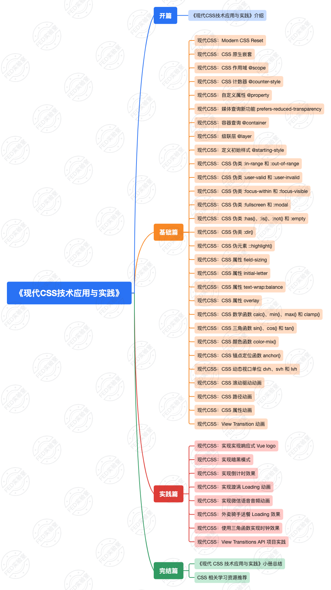

# 《现代CSS技术应用与实践》小册上线啦

## 前言

1994 年，CSS 的最初想法由哈肯·维姆·莱（Håkon Wium Lie）提出，他与伯特·波斯（Bert Bos）合作设计了 CSS。1996 年，W3C（万维网联盟）发布了 CSS 1.0 规范，标志着 CSS 的诞生。

CSS 从 1.0 进化到 3.0，带来众多特性更新。尤其在 CSS 3.0 引入了渐变、阴影、动画、转换等新特性，支持了多列布局和媒体查询，使得网页设计更加丰富和动态。

过去的一年，对 CSS 来说是重要的一年​。​迎来了众多功能更新，从基础到展现，再到交互，让开发人员实现了曾经认为在 Web 开发中不可能实现的众多功能。`container queries`、`subgrid`、`:has()`、选择器、颜色函数等已经被所有**现代浏览器**所支持。此外 Chrome 浏览器还可以使用 CSS 的滚动驱动动画，并能通过视图转换在网页视图之间流畅地显示动画。最重要的是，如 CSS 嵌套和 Scope 块级作用域等，也为开发人员带来了更好的开发体验。

## 小册介绍

《现代CSS技术应用与实践》是一本专注于现代CSS 技术应用与实践的指导手册。小册旨在帮助读者深入理解现代CSS 新特性的概念、原理和应用，掌握现代CSS 技术的最新进展和实践经验，从而提升网页设计和开发的技能。小册内容涵盖现代CSS 的基础知识、CSS 嵌套及作用域、CSS 布局技术与技巧、CSS 动画与过渡、CSS 实战案例等内容。

## 面向对象

- Web 前端开发人员；
- 有一定工作经验的 CSS 开发者；
- 有兴趣提升 CSS 技能的开发人员和爱好者；

## 学习收获

- 掌握现代 CSS 相关新特性；
- 参与现代 CSS 技术应用与实践；
- 增强现代 CSS 相关技术能力；
- 完善现代 CSS 技术体系；

## 扫描二维码快速学习

关注**FED实验室**公众号，加 **@小懒** 好友，进 **现代CSS技术交流群** 一起学习。

🤝 (〃'▽'〃)！